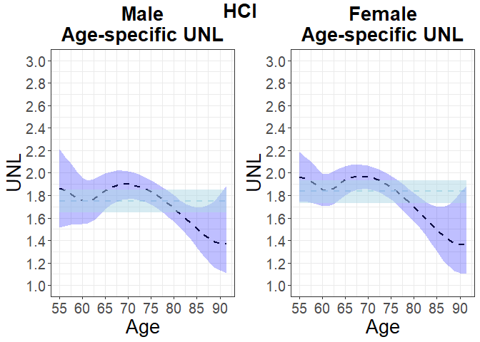
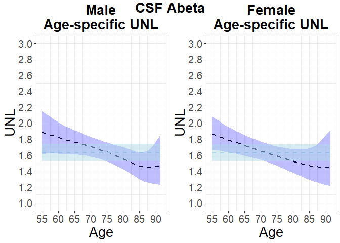
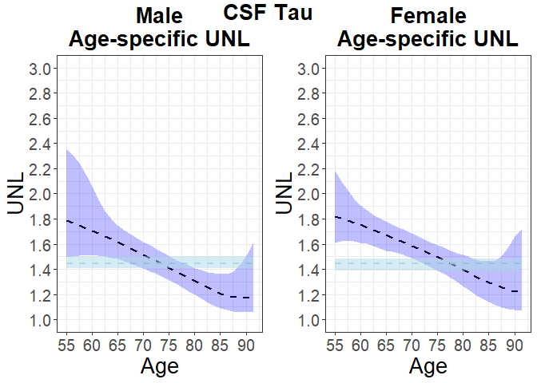
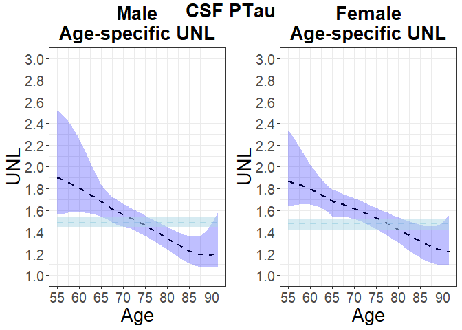

Tutorial for the application section in the paper “The Underlap
Coefficient as Measure of a Biomarker’s Discriminatory Ability”
================
Zhaoxi Zhang, Vanda Inácio, and Miguel de Carvalho

In this tutorial we describe the steps for obtaining the results of the
application to Alzheimer’s disease in Section 5 of the paper "The
Underlap Coefficient as Measure of a Biomarker’s Discriminatory
Ability".

As a preliminary step, we load on a clean environment all the required
libraries.

``` r
library(ggplot2) 
library(coda)    
library(splines) 
library(pracma)
library(DIRECT)
library(LSBP)
library(sn)
library(rjags)
library(nor1mix)
library(future)
library(future.apply)
library(MASS)
library(gridExtra)
library(cowplot)
```

We need to load some predefined functions for the ADNI application
study.

``` r
source("../functions/adni_application_functions.R")
```

After preprocessing, we fit an LSBP model with age and gender as
covariates to each biomarker–disease-group combination, allowing either
linear effects or a B-spline basis expansion with 0–3 interior knots.

``` r
file="//csce.datastore.ed.ac.uk/csce/maths/groups/mdt/adni_data.RData"
load(file = file)
adni$HCI=log(adni$HCI)
adni$abeta=log(adni$abeta)
adni$tau=log(adni$tau)
adni$ptau=log(adni$ptau)
adni$gender=as.factor(adni$gender)
adni_1=adni[adni$DX==1,]
adni_2=adni[adni$DX==2,]
adni_3=adni[adni$DX==3,]

adni_1_HCI=na.omit(adni_1[,c(3,4,8)]);adni_2_HCI=na.omit(adni_2[,c(3,4,8)]);adni_3_HCI=na.omit(adni_3[,c(3,4,8)])
adni_1_tau=na.omit(adni_1[,c(3,4,6)]);adni_2_tau=na.omit(adni_2[,c(3,4,6)]);adni_3_tau=na.omit(adni_3[,c(3,4,6)])
adni_1_ptau=na.omit(adni_1[,c(3,4,7)]);adni_2_ptau=na.omit(adni_2[,c(3,4,7)]);adni_3_ptau=na.omit(adni_3[,c(3,4,7)])
adni_1_abeta=na.omit(adni_1[,c(3,4,5)]);adni_2_abeta=na.omit(adni_2[,c(3,4,5)]);adni_3_abeta=na.omit(adni_3[,c(3,4,5)])

adni_1_HCI_scaled=data.frame(HCI=scale(adni_1_HCI$HCI),gender=adni_1_HCI$gender)
adni_2_HCI_scaled=data.frame(HCI=scale(adni_2_HCI$HCI),gender=adni_2_HCI$gender)
adni_3_HCI_scaled=data.frame(HCI=scale(adni_3_HCI$HCI),gender=adni_3_HCI$gender)

adni_1_abeta_scaled=data.frame(abeta=scale(adni_1_abeta$abeta),gender=adni_1_abeta$gender)
adni_2_abeta_scaled=data.frame(abeta=scale(adni_2_abeta$abeta),gender=adni_2_abeta$gender)
adni_3_abeta_scaled=data.frame(abeta=scale(adni_3_abeta$abeta),gender=adni_3_abeta$gender)

adni_1_tau_scaled=data.frame(tau=scale(adni_1_tau$tau),gender=adni_1_tau$gender)
adni_2_tau_scaled=data.frame(tau=scale(adni_2_tau$tau),gender=adni_2_tau$gender)
adni_3_tau_scaled=data.frame(tau=scale(adni_3_tau$tau),gender=adni_3_tau$gender)

adni_1_ptau_scaled=data.frame(ptau=scale(adni_1_ptau$ptau),gender=adni_1_ptau$gender)
adni_2_ptau_scaled=data.frame(ptau=scale(adni_2_ptau$ptau),gender=adni_2_ptau$gender)
adni_3_ptau_scaled=data.frame(ptau=scale(adni_3_ptau$ptau),gender=adni_3_ptau$gender)


n         <- nrow(adni) # Number of observations
p         <- 3         # Row and colums of the design for the kernel
p_splines <- 2         # Number of splines components
R         <- 10000     # Number of replications
burn_in   <- 5000      # Burn-in period
H         <- 20        # Number of mixture components

p_bsn0         <- 3         # Row and colums of the design for the kernel
p_splines_bsn0 <- 3         # Number of splines components

p_bsn1         <- 3         # Row and colums of the design for the kernel
p_splines_bsn1 <- 4         # Number of splines components

p_bsn2         <- 3         # Row and colums of the design for the kernel
p_splines_bsn2 <- 5         # Number of splines components

p_bsn3         <- 3         # Row and colums of the design for the kernel
p_splines_bsn3 <- 6         # Number of splines components

prior <- prior_LSBP(p,p,
                    b_kernel = rep(0,p_splines+1), B_kernel=diag(10,p_splines+1), 
                    b_mixing = rep(0,p), B_mixing=diag(10,p), 
                    a_tau = 2, b_tau= 0.5)

prior_bsn0 <- prior_LSBP(p_bsn0,p_bsn0,
                         b_kernel = rep(0,p_splines_bsn0+2), B_kernel=diag(10,p_splines_bsn0+2), 
                         b_mixing = rep(0,p_bsn0), B_mixing=diag(10,p_bsn0), 
                         a_tau = 2, b_tau= 0.5)

prior_bsn1 <- prior_LSBP(p_bsn1,p_bsn1,
                         b_kernel = rep(0,p_splines_bsn1+2), B_kernel=diag(10,p_splines_bsn1+2), 
                         b_mixing = rep(0,p_bsn1), B_mixing=diag(10,p_bsn1), 
                         a_tau = 2, b_tau= 0.5)

prior_bsn2 <- prior_LSBP(p_bsn2,p_bsn2,
                         b_kernel = rep(0,p_splines_bsn2+2), B_kernel=diag(10,p_splines_bsn2+2), 
                         b_mixing = rep(0,p_bsn2), B_mixing=diag(10,p_bsn2), 
                         a_tau = 2, b_tau= 0.5)

prior_bsn3 <- prior_LSBP(p_bsn3,p_bsn3,
                         b_kernel = rep(0,p_splines_bsn3+2), B_kernel=diag(10,p_splines_bsn3+2), 
                         b_mixing = rep(0,p_bsn3), B_mixing=diag(10,p_bsn3), 
                         a_tau = 2, b_tau= 0.5)


adni_1_fitting=adni_1
adni_2_fitting=adni_2
adni_3_fitting=adni_3

model_formula_HCI <- as.list(Formula::as.Formula(y ~ age+gender | age+gender))
model_formula_abeta <- as.list(Formula::as.Formula(y ~ age+gender | age+gender))
model_formula_tau <- as.list(Formula::as.Formula(y ~ age+gender | age+gender))
model_formula_ptau <- as.list(Formula::as.Formula(y ~ age+gender | age+gender))

model_formula_HCI_bsn0 <- as.list(Formula::as.Formula(y ~ BS.1+BS.2+BS.3+gender | age+gender))
model_formula_abeta_bsn0 <- as.list(Formula::as.Formula(y ~ BS.1+BS.2+BS.3+gender | age+gender))
model_formula_tau_bsn0 <- as.list(Formula::as.Formula(y ~ BS.1+BS.2+BS.3+gender | age+gender))
model_formula_ptau_bsn0 <- as.list(Formula::as.Formula(y ~ BS.1+BS.2+BS.3+gender | age+gender))

model_formula_HCI_bsn1 <- as.list(Formula::as.Formula(y ~ BS.1+BS.2+BS.3+BS.4+gender | age+gender))
model_formula_abeta_bsn1 <- as.list(Formula::as.Formula(y ~ BS.1+BS.2+BS.3+BS.4+gender | age+gender))
model_formula_tau_bsn1 <- as.list(Formula::as.Formula(y ~ BS.1+BS.2+BS.3+BS.4+gender | age+gender))
model_formula_ptau_bsn1 <- as.list(Formula::as.Formula(y ~ BS.1+BS.2+BS.3+BS.4+gender | age+gender))

model_formula_HCI_bsn2 <- as.list(Formula::as.Formula(y ~ BS.1+BS.2+BS.3+BS.4+BS.5+gender | age+gender))
model_formula_abeta_bsn2 <- as.list(Formula::as.Formula(y ~ BS.1+BS.2+BS.3+BS.4+BS.5+gender | age+gender))
model_formula_tau_bsn2 <- as.list(Formula::as.Formula(y ~ BS.1+BS.2+BS.3+BS.4+BS.5+gender | age+gender))
model_formula_ptau_bsn2 <- as.list(Formula::as.Formula(y ~ BS.1+BS.2+BS.3+BS.4+BS.5+gender | age+gender))

model_formula_HCI_bsn3 <- as.list(Formula::as.Formula(y ~ BS.1+BS.2+BS.3+BS.4+BS.5+BS.6+gender | age+gender))
model_formula_abeta_bsn3 <- as.list(Formula::as.Formula(y ~ BS.1+BS.2+BS.3+BS.4+BS.5+BS.6+gender | age+gender))
model_formula_tau_bsn3 <- as.list(Formula::as.Formula(y ~ BS.1+BS.2+BS.3+BS.4+BS.5+BS.6+gender | age+gender))
model_formula_ptau_bsn3 <- as.list(Formula::as.Formula(y ~ BS.1+BS.2+BS.3+BS.4+BS.5+BS.6+gender | age+gender))


inf_HCI=fit_and_cal_inf_con(data_con1=adni_1_fitting,data_con2=adni_2_fitting,data_con3=adni_3_fitting,
                            response="HCI",R=R,burn_in=burn_in,prior=prior,H=H,
                            model_formula_y1=model_formula_HCI,model_formula_y2=model_formula_HCI,
                            model_formula_y3=model_formula_HCI)

inf_abeta=fit_and_cal_inf_con(data_con1=adni_1_fitting,data_con2=adni_2_fitting,data_con3=adni_3_fitting,
                              response="abeta",R=R,burn_in=burn_in,prior=prior,H=H,
                              model_formula_y1=model_formula_abeta,model_formula_y2=model_formula_abeta,
                              model_formula_y3=model_formula_abeta)

inf_tau=fit_and_cal_inf_con(data_con1=adni_1_fitting,data_con2=adni_2_fitting,data_con3=adni_3_fitting,
                            response="tau",R=R,burn_in=burn_in,prior=prior,H=H,
                            model_formula_y1=model_formula_tau,model_formula_y2=model_formula_tau,
                            model_formula_y3=model_formula_tau)

inf_ptau=fit_and_cal_inf_con(data_con1=adni_1_fitting,data_con2=adni_2_fitting,data_con3=adni_3_fitting,
                             response="ptau",R=R,burn_in=burn_in,prior=prior,H=H,
                             model_formula_y1=model_formula_ptau,model_formula_y2=model_formula_ptau,
                             model_formula_y3=model_formula_ptau)

##
inf_HCI_bsn0=fit_and_cal_inf_con_bs(data_con1=adni_1_fitting,data_con2=adni_2_fitting,data_con3=adni_3_fitting,
                                    response="HCI",R=R,burn_in=burn_in,prior=prior_bsn0,H=H,
                                    model_formula_y1=model_formula_HCI_bsn0,model_formula_y2=model_formula_HCI_bsn0,
                                    model_formula_y3=model_formula_HCI_bsn0,nknots=0)

inf_abeta_bsn0=fit_and_cal_inf_con_bs(data_con1=adni_1_fitting,data_con2=adni_2_fitting,data_con3=adni_3_fitting,
                                      response="abeta",R=R,burn_in=burn_in,prior=prior_bsn0,H=H,
                                      model_formula_y1=model_formula_abeta_bsn0,model_formula_y2=model_formula_abeta_bsn0,
                                      model_formula_y3=model_formula_abeta_bsn0,nknots=0)

inf_tau_bsn0=fit_and_cal_inf_con_bs(data_con1=adni_1_fitting,data_con2=adni_2_fitting,data_con3=adni_3_fitting,
                                    response="tau",R=R,burn_in=burn_in,prior=prior_bsn0,H=H,
                                    model_formula_y1=model_formula_tau_bsn0,model_formula_y2=model_formula_tau_bsn0,
                                    model_formula_y3=model_formula_tau_bsn0,nknots=0)

inf_ptau_bsn0=fit_and_cal_inf_con_bs(data_con1=adni_1_fitting,data_con2=adni_2_fitting,data_con3=adni_3_fitting,
                                     response="ptau",R=R,burn_in=burn_in,prior=prior_bsn0,H=H,
                                     model_formula_y1=model_formula_ptau_bsn0,model_formula_y2=model_formula_ptau_bsn0,
                                     model_formula_y3=model_formula_ptau_bsn0,nknots=0)

##
inf_HCI_bsn1=fit_and_cal_inf_con_bs(data_con1=adni_1_fitting,data_con2=adni_2_fitting,data_con3=adni_3_fitting,
                                    response="HCI",R=R,burn_in=burn_in,prior=prior_bsn1,H=H,
                                    model_formula_y1=model_formula_HCI_bsn1,model_formula_y2=model_formula_HCI_bsn1,
                                    model_formula_y3=model_formula_HCI_bsn1,nknots=1)

inf_abeta_bsn1=fit_and_cal_inf_con_bs(data_con1=adni_1_fitting,data_con2=adni_2_fitting,data_con3=adni_3_fitting,
                                      response="abeta",R=R,burn_in=burn_in,prior=prior_bsn1,H=H,
                                      model_formula_y1=model_formula_abeta_bsn1,model_formula_y2=model_formula_abeta_bsn1,
                                      model_formula_y3=model_formula_abeta_bsn1,nknots=1)

inf_tau_bsn1=fit_and_cal_inf_con_bs(data_con1=adni_1_fitting,data_con2=adni_2_fitting,data_con3=adni_3_fitting,
                                    response="tau",R=R,burn_in=burn_in,prior=prior_bsn1,H=H,
                                    model_formula_y1=model_formula_tau_bsn1,model_formula_y2=model_formula_tau_bsn1,
                                    model_formula_y3=model_formula_tau_bsn1,nknots=1)

inf_ptau_bsn1=fit_and_cal_inf_con_bs(data_con1=adni_1_fitting,data_con2=adni_2_fitting,data_con3=adni_3_fitting,
                                     response="ptau",R=R,burn_in=burn_in,prior=prior_bsn1,H=H,
                                     model_formula_y1=model_formula_ptau_bsn1,model_formula_y2=model_formula_ptau_bsn1,
                                     model_formula_y3=model_formula_ptau_bsn1,nknots=1)

##
inf_HCI_bsn2=fit_and_cal_inf_con_bs(data_con1=adni_1_fitting,data_con2=adni_2_fitting,data_con3=adni_3_fitting,
                                    response="HCI",R=R,burn_in=burn_in,prior=prior_bsn2,H=H,
                                    model_formula_y1=model_formula_HCI_bsn2,model_formula_y2=model_formula_HCI_bsn2,
                                    model_formula_y3=model_formula_HCI_bsn2,nknots=2)

inf_abeta_bsn2=fit_and_cal_inf_con_bs(data_con1=adni_1_fitting,data_con2=adni_2_fitting,data_con3=adni_3_fitting,
                                      response="abeta",R=R,burn_in=burn_in,prior=prior_bsn2,H=H,
                                      model_formula_y1=model_formula_abeta_bsn2,model_formula_y2=model_formula_abeta_bsn2,
                                      model_formula_y3=model_formula_abeta_bsn2,nknots=2)

inf_tau_bsn2=fit_and_cal_inf_con_bs(data_con1=adni_1_fitting,data_con2=adni_2_fitting,data_con3=adni_3_fitting,
                                    response="tau",R=R,burn_in=burn_in,prior=prior_bsn2,H=H,
                                    model_formula_y1=model_formula_tau_bsn2,model_formula_y2=model_formula_tau_bsn2,
                                    model_formula_y3=model_formula_tau_bsn2,nknots=2)

inf_ptau_bsn2=fit_and_cal_inf_con_bs(data_con1=adni_1_fitting,data_con2=adni_2_fitting,data_con3=adni_3_fitting,
                                     response="ptau",R=R,burn_in=burn_in,prior=prior_bsn2,H=H,
                                     model_formula_y1=model_formula_ptau_bsn2,model_formula_y2=model_formula_ptau_bsn2,
                                     model_formula_y3=model_formula_ptau_bsn2,nknots=2)

##
inf_HCI_bsn3=fit_and_cal_inf_con_bs(data_con1=adni_1_fitting,data_con2=adni_2_fitting,data_con3=adni_3_fitting,
                                    response="HCI",R=R,burn_in=burn_in,prior=prior_bsn3,H=H,
                                    model_formula_y1=model_formula_HCI_bsn3,model_formula_y2=model_formula_HCI_bsn3,
                                    model_formula_y3=model_formula_HCI_bsn3,nknots=3)

inf_abeta_bsn3=fit_and_cal_inf_con_bs(data_con1=adni_1_fitting,data_con2=adni_2_fitting,data_con3=adni_3_fitting,
                                      response="abeta",R=R,burn_in=burn_in,prior=prior_bsn3,H=H,
                                      model_formula_y1=model_formula_abeta_bsn3,model_formula_y2=model_formula_abeta_bsn3,
                                      model_formula_y3=model_formula_abeta_bsn3,nknots=3)

inf_tau_bsn3=fit_and_cal_inf_con_bs(data_con1=adni_1_fitting,data_con2=adni_2_fitting,data_con3=adni_3_fitting,
                                    response="tau",R=R,burn_in=burn_in,prior=prior_bsn3,H=H,
                                    model_formula_y1=model_formula_tau_bsn3,model_formula_y2=model_formula_tau_bsn3,
                                    model_formula_y3=model_formula_tau_bsn3,nknots=3)

inf_ptau_bsn3=fit_and_cal_inf_con_bs(data_con1=adni_1_fitting,data_con2=adni_2_fitting,data_con3=adni_3_fitting,
                                     response="ptau",R=R,burn_in=burn_in,prior=prior_bsn3,H=H,
                                     model_formula_y1=model_formula_ptau_bsn3,model_formula_y2=model_formula_ptau_bsn3,
                                     model_formula_y3=model_formula_ptau_bsn3,nknots=3)
```

We guided our model choice using the WAIC criterion and adopted a
parsimonious strategy, selecting a more complex model over a simpler one
(e.g., a linear trend over a B-splines basis expansion with one interior
knot) only if the criterion value differs by more than 5 units (the same
strategy we used in the simulation study). For all combinations of
disease groups and biomarkers, except for one, a linear effect of age
was used when modelling both the components’ weights and means. In the
CN group for the HCI biomarker, the age effect was modelled using a
B-spline basis with no interior knots. Based on the selected model, we
estimated the age & gender-specific UNL.

``` r
age.points =seq(from=min(adni$age,na.rm =TRUE),to=max(adni$age,na.rm =TRUE),length.out=30)
age.points1=(age.points-mean(adni_1$age))/sd(adni_1$age)
age.points2=(age.points-mean(adni_2$age))/sd(adni_2$age)
age.points3=(age.points-mean(adni_3$age))/sd(adni_3$age)

gender2.points=c(0,1)

slct_index=c(c(5,15,25),30+c(5,15,25))


# And the correspondings design matrices
X1_1=rbind(cbind(1,age.points1,gender2.points[1]),cbind(1,age.points1,gender2.points[2]))
X2_1=rbind(cbind(1,age.points1,gender2.points[1]),cbind(1,age.points1,gender2.points[2]))

X1_2=rbind(cbind(1,age.points2,gender2.points[1]),cbind(1,age.points2,gender2.points[2]))
X2_2=rbind(cbind(1,age.points2,gender2.points[1]),cbind(1,age.points2,gender2.points[2]))

X1_3=rbind(cbind(1,age.points3,gender2.points[1]),cbind(1,age.points3,gender2.points[2]))
X2_3=rbind(cbind(1,age.points3,gender2.points[1]),cbind(1,age.points3,gender2.points[2]))

##
X1_1_gender=X2_1_gender=X1_2_gender=X2_2_gender=X1_3_gender=X2_3_gender=cbind(1,c(0,1))

# Design matrix for the kernel

age_fitting1=adni_1_fitting$age;age_fitting2=adni_2_fitting$age;age_fitting3=adni_3_fitting$age
age1_bsn0.points=predict(bs(age_fitting1, intercept = FALSE, degree = 3, knots = c()),age.points)
age1_bsn1.points=predict(bs(age_fitting1, intercept = FALSE, degree = 3, knots = c(0.5)),age.points)
age1_bsn2.points=predict(bs(age_fitting1, intercept = FALSE, degree = 3,
                            knots = quantile(age_fitting1,probs = c(0.33,0.66)),age.points))
age1_bsn3.points=predict(bs(age_fitting1, intercept = FALSE, degree = 3,
                            knots = quantile(age_fitting1,probs = c(0.25,0.5,0.75)),age.points))

age2_bsn0.points=predict(bs(age_fitting2, intercept = FALSE, degree = 3, knots = c()),age.points)
age2_bsn1.points=predict(bs(age_fitting2, intercept = FALSE, degree = 3, knots = c(0.5)),age.points)
age2_bsn2.points=predict(bs(age_fitting2, intercept = FALSE, degree = 3,
                            knots = quantile(age_fitting2,probs = c(0.33,0.66)),age.points))
age2_bsn3.points=predict(bs(age_fitting2, intercept = FALSE, degree = 3,
                            knots = quantile(age_fitting2,probs = c(0.25,0.5,0.75)),age.points))

age3_bsn0.points=predict(bs(age_fitting3, intercept = FALSE, degree = 3, knots = c()),age.points)
age3_bsn1.points=predict(bs(age_fitting3, intercept = FALSE, degree = 3, knots = c(0.5)),age.points)
age3_bsn2.points=predict(bs(age_fitting3, intercept = FALSE, degree = 3,
                            knots = quantile(age_fitting3,probs = c(0.33,0.66)),age.points))
age3_bsn3.points=predict(bs(age_fitting3, intercept = FALSE, degree = 3,
                            knots = quantile(age_fitting3,probs = c(0.25,0.5,0.75)),age.points))

##
age1_bsn0=data.frame(BS=bs(age_fitting1, intercept = FALSE, degree = 3, knots = c()))
age1_bsn1=data.frame(BS=bs(age_fitting1, intercept = FALSE, degree = 3, knots = c(0.5)))
age1_bsn2=data.frame(BS=bs(age_fitting1, intercept = FALSE, degree = 3,
                           knots = quantile(age_fitting1,probs = c(0.33,0.66))))
age1_bsn3=data.frame(BS=bs(age_fitting1, intercept = FALSE, degree = 3,
                           knots = quantile(age_fitting1,probs = c(0.25,0.5,0.75))))

age2_bsn0=data.frame(BS=bs(age_fitting2, intercept = FALSE, degree = 3, knots = c()))
age2_bsn1=data.frame(BS=bs(age_fitting2, intercept = FALSE, degree = 3, knots = c(0.5)))
age2_bsn2=data.frame(BS=bs(age_fitting2, intercept = FALSE, degree = 3,
                           knots = quantile(age_fitting2,probs = c(0.33,0.66))))
age2_bsn3=data.frame(BS=bs(age_fitting2, intercept = FALSE, degree = 3,
                           knots = quantile(age_fitting2,probs = c(0.25,0.5,0.75))))

age3_bsn0=data.frame(BS=bs(age_fitting3, intercept = FALSE, degree = 3, knots = c()))
age3_bsn1=data.frame(BS=bs(age_fitting3, intercept = FALSE, degree = 3, knots = c(0.5)))
age3_bsn2=data.frame(BS=bs(age_fitting3, intercept = FALSE, degree = 3,
                           knots = quantile(age_fitting3,probs = c(0.33,0.66))))
age3_bsn3=data.frame(BS=bs(age_fitting3, intercept = FALSE, degree = 3,
                           knots = quantile(age_fitting3,probs = c(0.25,0.5,0.75))))

age_bsn0.points1=cbind((age1_bsn0.points[,1]-mean(age1_bsn0$BS.1))/sd(age1_bsn0$BS.1),
                       (age1_bsn0.points[,2]-mean(age1_bsn0$BS.2))/sd(age1_bsn0$BS.2),
                       (age1_bsn0.points[,3]-mean(age1_bsn0$BS.3))/sd(age1_bsn0$BS.3))
age_bsn1.points1=cbind((age1_bsn1.points[,1]-mean(age1_bsn1$BS.1))/sd(age1_bsn1$BS.1),
                       (age1_bsn1.points[,2]-mean(age1_bsn1$BS.2))/sd(age1_bsn1$BS.2),
                       (age1_bsn1.points[,3]-mean(age1_bsn1$BS.3))/sd(age1_bsn1$BS.3),
                       (age1_bsn1.points[,4]-mean(age1_bsn1$BS.4))/sd(age1_bsn1$BS.4))
age_bsn2.points1=cbind((age1_bsn2.points[,1]-mean(age1_bsn2$BS.1))/sd(age1_bsn2$BS.1),
                       (age1_bsn2.points[,2]-mean(age1_bsn2$BS.2))/sd(age1_bsn2$BS.2),
                       (age1_bsn2.points[,3]-mean(age1_bsn2$BS.3))/sd(age1_bsn2$BS.3),
                       (age1_bsn2.points[,4]-mean(age1_bsn2$BS.4))/sd(age1_bsn2$BS.4),
                       (age1_bsn2.points[,5]-mean(age1_bsn2$BS.5))/sd(age1_bsn2$BS.5))
age_bsn3.points1=cbind((age1_bsn3.points[,1]-mean(age1_bsn3$BS.1))/sd(age1_bsn3$BS.1),
                       (age1_bsn3.points[,2]-mean(age1_bsn3$BS.2))/sd(age1_bsn3$BS.2),
                       (age1_bsn3.points[,3]-mean(age1_bsn3$BS.3))/sd(age1_bsn3$BS.3),
                       (age1_bsn3.points[,4]-mean(age1_bsn3$BS.4))/sd(age1_bsn3$BS.4),
                       (age1_bsn3.points[,5]-mean(age1_bsn3$BS.5))/sd(age1_bsn3$BS.5),
                       (age1_bsn3.points[,6]-mean(age1_bsn3$BS.6))/sd(age1_bsn3$BS.6))

age_bsn0.points2=cbind((age2_bsn0.points[,1]-mean(age2_bsn0$BS.1))/sd(age2_bsn0$BS.1),
                       (age2_bsn0.points[,2]-mean(age2_bsn0$BS.2))/sd(age2_bsn0$BS.2),
                       (age2_bsn0.points[,3]-mean(age2_bsn0$BS.3))/sd(age2_bsn0$BS.3))
age_bsn1.points2=cbind((age2_bsn1.points[,1]-mean(age2_bsn1$BS.1))/sd(age2_bsn1$BS.1),
                       (age2_bsn1.points[,2]-mean(age2_bsn1$BS.2))/sd(age2_bsn1$BS.2),
                       (age2_bsn1.points[,3]-mean(age2_bsn1$BS.3))/sd(age2_bsn1$BS.3),
                       (age2_bsn1.points[,4]-mean(age2_bsn1$BS.4))/sd(age2_bsn1$BS.4))
age_bsn2.points2=cbind((age2_bsn2.points[,1]-mean(age2_bsn2$BS.1))/sd(age2_bsn2$BS.1),
                       (age2_bsn2.points[,2]-mean(age2_bsn2$BS.2))/sd(age2_bsn2$BS.2),
                       (age2_bsn2.points[,3]-mean(age2_bsn2$BS.3))/sd(age2_bsn2$BS.3),
                       (age2_bsn2.points[,4]-mean(age2_bsn2$BS.4))/sd(age2_bsn2$BS.4),
                       (age2_bsn2.points[,5]-mean(age2_bsn2$BS.5))/sd(age2_bsn2$BS.5))
age_bsn3.points2=cbind((age2_bsn3.points[,1]-mean(age2_bsn3$BS.1))/sd(age2_bsn3$BS.1),
                       (age2_bsn3.points[,2]-mean(age2_bsn3$BS.2))/sd(age2_bsn3$BS.2),
                       (age2_bsn3.points[,3]-mean(age2_bsn3$BS.3))/sd(age2_bsn3$BS.3),
                       (age2_bsn3.points[,4]-mean(age2_bsn3$BS.4))/sd(age2_bsn3$BS.4),
                       (age2_bsn3.points[,5]-mean(age2_bsn3$BS.5))/sd(age2_bsn3$BS.5),
                       (age2_bsn3.points[,6]-mean(age2_bsn3$BS.6))/sd(age2_bsn3$BS.6))

age_bsn0.points3=cbind((age3_bsn0.points[,1]-mean(age3_bsn0$BS.1))/sd(age3_bsn0$BS.1),
                       (age3_bsn0.points[,2]-mean(age3_bsn0$BS.2))/sd(age3_bsn0$BS.2),
                       (age3_bsn0.points[,3]-mean(age3_bsn0$BS.3))/sd(age3_bsn0$BS.3))
age_bsn1.points3=cbind((age3_bsn1.points[,1]-mean(age3_bsn1$BS.1))/sd(age3_bsn1$BS.1),
                       (age3_bsn1.points[,2]-mean(age3_bsn1$BS.2))/sd(age3_bsn1$BS.2),
                       (age3_bsn1.points[,3]-mean(age3_bsn1$BS.3))/sd(age3_bsn1$BS.3),
                       (age3_bsn1.points[,4]-mean(age3_bsn1$BS.4))/sd(age3_bsn1$BS.4))
age_bsn2.points3=cbind((age3_bsn2.points[,1]-mean(age3_bsn2$BS.1))/sd(age3_bsn2$BS.1),
                       (age3_bsn2.points[,2]-mean(age3_bsn2$BS.2))/sd(age3_bsn2$BS.2),
                       (age3_bsn2.points[,3]-mean(age3_bsn2$BS.3))/sd(age3_bsn2$BS.3),
                       (age3_bsn2.points[,4]-mean(age3_bsn2$BS.4))/sd(age3_bsn2$BS.4),
                       (age3_bsn2.points[,5]-mean(age3_bsn2$BS.5))/sd(age3_bsn2$BS.5))
age_bsn3.points3=cbind((age3_bsn3.points[,1]-mean(age3_bsn3$BS.1))/sd(age3_bsn3$BS.1),
                       (age3_bsn3.points[,2]-mean(age3_bsn3$BS.2))/sd(age3_bsn3$BS.2),
                       (age3_bsn3.points[,3]-mean(age3_bsn3$BS.3))/sd(age3_bsn3$BS.3),
                       (age3_bsn3.points[,4]-mean(age3_bsn3$BS.4))/sd(age3_bsn3$BS.4),
                       (age3_bsn3.points[,5]-mean(age3_bsn3$BS.5))/sd(age3_bsn3$BS.5),
                       (age3_bsn3.points[,6]-mean(age3_bsn3$BS.6))/sd(age3_bsn3$BS.6))


X1_1_bsn0=rbind(cbind(1,age_bsn0.points1,gender2.points[1]),cbind(1,age_bsn0.points1,gender2.points[2]))
X1_1_bsn1=rbind(cbind(1,age_bsn1.points1,gender2.points[1]),cbind(1,age_bsn1.points1,gender2.points[2]))
X1_1_bsn2=rbind(cbind(1,age_bsn2.points1,gender2.points[1]),cbind(1,age_bsn2.points1,gender2.points[2]))
X1_1_bsn3=rbind(cbind(1,age_bsn3.points1,gender2.points[1]),cbind(1,age_bsn3.points1,gender2.points[2]))

X1_2_bsn0=rbind(cbind(1,age_bsn0.points2,gender2.points[1]),cbind(1,age_bsn0.points2,gender2.points[2]))
X1_2_bsn1=rbind(cbind(1,age_bsn1.points2,gender2.points[1]),cbind(1,age_bsn1.points2,gender2.points[2]))
X1_2_bsn2=rbind(cbind(1,age_bsn2.points2,gender2.points[1]),cbind(1,age_bsn2.points2,gender2.points[2]))
X1_2_bsn3=rbind(cbind(1,age_bsn3.points2,gender2.points[1]),cbind(1,age_bsn3.points2,gender2.points[2]))

X1_3_bsn0=rbind(cbind(1,age_bsn0.points3,gender2.points[1]),cbind(1,age_bsn0.points3,gender2.points[2]))
X1_3_bsn1=rbind(cbind(1,age_bsn1.points3,gender2.points[1]),cbind(1,age_bsn1.points3,gender2.points[2]))
X1_3_bsn2=rbind(cbind(1,age_bsn2.points3,gender2.points[1]),cbind(1,age_bsn2.points3,gender2.points[2]))
X1_3_bsn3=rbind(cbind(1,age_bsn3.points3,gender2.points[1]),cbind(1,age_bsn3.points3,gender2.points[2]))


# Sequence for AGE and DDE
HCI_grid <- seq(from=0,to=max(adni$HCI,na.rm =TRUE)+1,length.out=501)
HCI_grid1=(HCI_grid-mean(adni_1_HCI$HCI))/sd(adni_1_HCI$HCI)
HCI_grid2=(HCI_grid-mean(adni_2_HCI$HCI))/sd(adni_2_HCI$HCI)
HCI_grid3=(HCI_grid-mean(adni_3_HCI$HCI))/sd(adni_3_HCI$HCI)

abeta_grid <- seq(from=min(adni$abeta,na.rm =TRUE)-1,to=max(adni$abeta,na.rm =TRUE)+1,length.out=501)
abeta_grid1=(abeta_grid-mean(adni_1_abeta$abeta))/sd(adni_1_abeta$abeta)
abeta_grid2=(abeta_grid-mean(adni_2_abeta$abeta))/sd(adni_2_abeta$abeta)
abeta_grid3=(abeta_grid-mean(adni_3_abeta$abeta))/sd(adni_3_abeta$abeta)

tau_grid <- seq(from=min(adni$tau,na.rm =TRUE)-1,to=max(adni$tau,na.rm =TRUE)+1,length.out=501)
tau_grid1=(tau_grid-mean(adni_1_tau$tau))/sd(adni_1_tau$tau)
tau_grid2=(tau_grid-mean(adni_2_tau$tau))/sd(adni_2_tau$tau)
tau_grid3=(tau_grid-mean(adni_3_tau$tau))/sd(adni_3_tau$tau)

ptau_grid <- seq(from=min(adni$ptau,na.rm =TRUE)-1,to=max(adni$ptau,na.rm =TRUE)+1,length.out=501)
ptau_grid1=(ptau_grid-mean(adni_1_ptau$ptau))/sd(adni_1_ptau$ptau)
ptau_grid2=(ptau_grid-mean(adni_2_ptau$ptau))/sd(adni_2_ptau$ptau)
ptau_grid3=(ptau_grid-mean(adni_3_ptau$ptau))/sd(adni_3_ptau$ptau)

sd_HCI1=sd(na.omit(data.frame(y=adni_1[["HCI"]],age=adni_1$age,gender=adni_1$gender))$y)
sd_HCI2=sd(na.omit(data.frame(y=adni_2[["HCI"]],age=adni_2$age,gender=adni_2$gender))$y)
sd_HCI3=sd(na.omit(data.frame(y=adni_3[["HCI"]],age=adni_3$age,gender=adni_3$gender))$y)

sd_abeta1=sd(na.omit(data.frame(y=adni_1[["abeta"]],age=adni_1$age,gender=adni_1$gender))$y)
sd_abeta2=sd(na.omit(data.frame(y=adni_2[["abeta"]],age=adni_2$age,gender=adni_2$gender))$y)
sd_abeta3=sd(na.omit(data.frame(y=adni_3[["abeta"]],age=adni_3$age,gender=adni_3$gender))$y)

sd_tau1=sd(na.omit(data.frame(y=adni_1[["tau"]],age=adni_1$age,gender=adni_1$gender))$y)
sd_tau2=sd(na.omit(data.frame(y=adni_2[["tau"]],age=adni_2$age,gender=adni_2$gender))$y)
sd_tau3=sd(na.omit(data.frame(y=adni_3[["tau"]],age=adni_3$age,gender=adni_3$gender))$y)

sd_ptau1=sd(na.omit(data.frame(y=adni_1[["ptau"]],age=adni_1$age,gender=adni_1$gender))$y)
sd_ptau2=sd(na.omit(data.frame(y=adni_2[["ptau"]],age=adni_2$age,gender=adni_2$gender))$y)
sd_ptau3=sd(na.omit(data.frame(y=adni_3[["ptau"]],age=adni_3$age,gender=adni_3$gender))$y)


eff_HCI=effect_size_conditional_density(fit_Gibbs1=inf_HCI_bsn0$fit_Gibbs1,fit_Gibbs2=inf_HCI$fit_Gibbs2,
                                        fit_Gibbs3=inf_HCI$fit_Gibbs3,
                                        R=R,slct_index=slct_index,
                                        X1_1=X1_1_bsn0,X2_1=X2_1,X1_2=X1_2,X2_2=X2_2,X1_3=X1_3,X2_3=X2_3,
                                        y_grid=HCI_grid,y_grid1=HCI_grid1,y_grid2=HCI_grid2,y_grid3=HCI_grid3,
                                        sd_y1=sd_HCI1,sd_y2=sd_HCI2,sd_y3=sd_HCI3)

eff_abeta=effect_size_conditional_density(fit_Gibbs1=inf_abeta$fit_Gibbs1,fit_Gibbs2=inf_abeta$fit_Gibbs2,
                                          fit_Gibbs3=inf_abeta$fit_Gibbs3,
                                          R=R,slct_index=slct_index,
                                          X1_1=X1_1,X2_1=X2_1,X1_2=X1_2,X2_2=X2_2,X1_3=X1_3,X2_3=X2_3,
                                          y_grid=abeta_grid,y_grid1=abeta_grid1,y_grid2=abeta_grid2,y_grid3=abeta_grid3,
                                          sd_y1=sd_abeta1,sd_y2=sd_abeta2,sd_y3=sd_abeta3)

eff_tau=effect_size_conditional_density(fit_Gibbs1=inf_tau$fit_Gibbs1,fit_Gibbs2=inf_tau$fit_Gibbs2,
                                        fit_Gibbs3=inf_tau$fit_Gibbs3,
                                        R=R,slct_index=slct_index,
                                        X1_1=X1_1,X2_1=X2_1,X1_2=X1_2,X2_2=X2_2,X1_3=X1_3,X2_3=X2_3,
                                        y_grid=tau_grid,y_grid1=tau_grid1,y_grid2=tau_grid2,y_grid3=tau_grid3,
                                        sd_y1=sd_tau1,sd_y2=sd_tau2,sd_y3=sd_tau3)

eff_ptau=effect_size_conditional_density(fit_Gibbs1=inf_ptau$fit_Gibbs1,fit_Gibbs2=inf_ptau$fit_Gibbs2,
                                         fit_Gibbs3=inf_ptau$fit_Gibbs3,
                                         R=R,slct_index=slct_index,
                                         X1_1=X1_1,X2_1=X2_1,X1_2=X1_2,X2_2=X2_2,X1_3=X1_3,X2_3=X2_3,
                                         y_grid=ptau_grid,y_grid1=ptau_grid1,y_grid2=ptau_grid2,y_grid3=ptau_grid3,
                                         sd_y1=sd_ptau1,sd_y2=sd_ptau2,sd_y3=sd_ptau3)
```

We also fit the gender-specific densities of each biomarker in each
disease groups by the LSBP model. Based on the gender-specific
densities, we estimate the gender-specific UNL.

``` r
n         <- nrow(adni) # Number of observations
R         <- 10000     # Number of replications
burn_in   <- 5000      # Burn-in period
H         <- 20        # Number of mixture components
p_gender         <- 2  # Row and colums of the design for the kernel
p_splines_gender <- 1  # Number of splines components

prior_gender <- prior_LSBP(p_gender,p_gender,
                           b_mixing = rep(0,p_splines_gender+1), B_mixing=diag(10,p_splines_gender+1), 
                           b_kernel = c(0,0), B_kernel=diag(10,p_gender), 
                           a_tau = 2, b_tau= 0.5)

model_formula_HCI_gender <- as.list(Formula::as.Formula(HCI ~ gender | gender))
model_formula_abeta_gender <- as.list(Formula::as.Formula(abeta ~ gender | gender))
model_formula_tau_gender <- as.list(Formula::as.Formula(tau ~ gender | gender))
model_formula_ptau_gender <- as.list(Formula::as.Formula(ptau ~ gender | gender))

##gender fit
set.seed(23) # The seed is setted so that the Gibbs sampler is reproducible.
fit_Gibbs1_HCI_gender   <- LSBP_Gibbs(model_formula_HCI_gender, data=adni_1_HCI_scaled, H=H, prior=prior_gender, 
                                      control=control_Gibbs(R=R,burn_in=burn_in,method_init="random"),
                                      verbose=TRUE)
set.seed(23) # The seed is setted so that the Gibbs sampler is reproducible.
fit_Gibbs2_HCI_gender   <- LSBP_Gibbs(model_formula_HCI_gender, data=adni_2_HCI_scaled, H=H, prior=prior_gender, 
                                      control=control_Gibbs(R=R,burn_in=burn_in,method_init="random"),
                                      verbose=TRUE)
set.seed(23) # The seed is setted so that the Gibbs sampler is reproducible.
fit_Gibbs3_HCI_gender   <- LSBP_Gibbs(model_formula_HCI_gender, data=adni_3_HCI_scaled, H=H, prior=prior_gender, 
                                      control=control_Gibbs(R=R,burn_in=burn_in,method_init="random"),
                                      verbose=TRUE)
#abeta
set.seed(23) # The seed is setted so that the Gibbs sampler is reproducible.
fit_Gibbs1_abeta_gender   <- LSBP_Gibbs(model_formula_abeta_gender, data=adni_1_abeta_scaled, H=H, prior=prior_gender, 
                                        control=control_Gibbs(R=R,burn_in=burn_in,method_init="random"),
                                        verbose=TRUE)
set.seed(23) # The seed is setted so that the Gibbs sampler is reproducible.
fit_Gibbs2_abeta_gender   <- LSBP_Gibbs(model_formula_abeta_gender, data=adni_2_abeta_scaled, H=H, prior=prior_gender, 
                                        control=control_Gibbs(R=R,burn_in=burn_in,method_init="random"),
                                        verbose=TRUE)
set.seed(23) # The seed is setted so that the Gibbs sampler is reproducible.
fit_Gibbs3_abeta_gender   <- LSBP_Gibbs(model_formula_abeta_gender, data=adni_3_abeta_scaled, H=H, prior=prior_gender, 
                                        control=control_Gibbs(R=R,burn_in=burn_in,method_init="random"),
                                        verbose=TRUE)
#tau
set.seed(23) # The seed is setted so that the Gibbs sampler is reproducible.
fit_Gibbs1_tau_gender   <- LSBP_Gibbs(model_formula_tau_gender, data=adni_1_tau_scaled, H=H, prior=prior_gender, 
                                      control=control_Gibbs(R=R,burn_in=burn_in,method_init="random"),
                                      verbose=TRUE)
set.seed(23) # The seed is setted so that the Gibbs sampler is reproducible.
fit_Gibbs2_tau_gender   <- LSBP_Gibbs(model_formula_tau_gender, data=adni_1_tau_scaled, H=H, prior=prior_gender, 
                                      control=control_Gibbs(R=R,burn_in=burn_in,method_init="random"),
                                      verbose=TRUE)
set.seed(23) # The seed is setted so that the Gibbs sampler is reproducible.
fit_Gibbs3_tau_gender   <- LSBP_Gibbs(model_formula_tau_gender, data=adni_1_tau_scaled, H=H, prior=prior_gender, 
                                      control=control_Gibbs(R=R,burn_in=burn_in,method_init="random"),
                                      verbose=TRUE)
#ptau
set.seed(23) # The seed is setted so that the Gibbs sampler is reproducible.
fit_Gibbs1_ptau_gender   <- LSBP_Gibbs(model_formula_ptau_gender, data=adni_1_ptau_scaled, H=H, prior=prior_gender, 
                                       control=control_Gibbs(R=R,burn_in=burn_in,method_init="random"),
                                       verbose=TRUE)
set.seed(23) # The seed is setted so that the Gibbs sampler is reproducible.
fit_Gibbs2_ptau_gender   <- LSBP_Gibbs(model_formula_ptau_gender, data=adni_1_ptau_scaled, H=H, prior=prior_gender, 
                                       control=control_Gibbs(R=R,burn_in=burn_in,method_init="random"),
                                       verbose=TRUE)
set.seed(23) # The seed is setted so that the Gibbs sampler is reproducible.
fit_Gibbs3_ptau_gender   <- LSBP_Gibbs(model_formula_ptau_gender, data=adni_1_ptau_scaled, H=H, prior=prior_gender, 
                                       control=control_Gibbs(R=R,burn_in=burn_in,method_init="random"),
                                       verbose=TRUE)


eff_HCI_gender=effect_size_conditional_density_gender(fit_Gibbs1=fit_Gibbs1_HCI_gender,fit_Gibbs2=fit_Gibbs2_HCI_gender,fit_Gibbs3=fit_Gibbs3_HCI_gender,
                                                      R=R,X1_1=X1_1_gender,X2_1=X2_1_gender,X1_2=X1_2_gender,X2_2=X2_2_gender,X1_3=X1_3_gender,X2_3=X2_3_gender,
                                                      y_grid=HCI_grid,y_grid1=HCI_grid1,y_grid2=HCI_grid2,y_grid3=HCI_grid3,
                                                      sd_y1=sd_HCI1,sd_y2=sd_HCI2,sd_y3=sd_HCI3)

eff_abeta_gender=effect_size_conditional_density_gender(fit_Gibbs1=fit_Gibbs1_abeta_gender,fit_Gibbs2=fit_Gibbs2_abeta_gender,fit_Gibbs3=fit_Gibbs3_abeta_gender,
                                                        R=R,X1_1=X1_1_gender,X2_1=X2_1_gender,X1_2=X1_2_gender,X2_2=X2_2_gender,X1_3=X1_3_gender,X2_3=X2_3_gender,
                                                        y_grid=abeta_grid,y_grid1=abeta_grid1,y_grid2=abeta_grid2,y_grid3=abeta_grid3,
                                                        sd_y1=sd_abeta1,sd_y2=sd_abeta2,sd_y3=sd_abeta3)

eff_tau_gender=effect_size_conditional_density_gender(fit_Gibbs1=fit_Gibbs1_tau_gender,fit_Gibbs2=fit_Gibbs2_tau_gender,fit_Gibbs3=fit_Gibbs3_tau_gender,
                                                      R=R,X1_1=X1_1_gender,X2_1=X2_1_gender,X1_2=X1_2_gender,X2_2=X2_2_gender,X1_3=X1_3_gender,X2_3=X2_3_gender,
                                                      y_grid=tau_grid,y_grid1=tau_grid1,y_grid2=tau_grid2,y_grid3=tau_grid3,
                                                      sd_y1=sd_tau1,sd_y2=sd_tau2,sd_y3=sd_tau3)

eff_ptau_gender=effect_size_conditional_density_gender(fit_Gibbs1=fit_Gibbs1_ptau_gender,fit_Gibbs2=fit_Gibbs2_ptau_gender,fit_Gibbs3=fit_Gibbs3_ptau_gender,
                                                       R=R,X1_1=X1_1_gender,X2_1=X2_1_gender,X1_2=X1_2_gender,X2_2=X2_2_gender,X1_3=X1_3_gender,X2_3=X2_3_gender,
                                                       y_grid=ptau_grid,y_grid1=ptau_grid1,y_grid2=ptau_grid2,y_grid3=ptau_grid3,
                                                       sd_y1=sd_ptau1,sd_y2=sd_ptau2,sd_y3=sd_ptau3)
```

## UNL plots alongside age by gender

We can then plot the age & gender-specific UNL and gender-specific UNL
for all 4 biomarkers together.

``` r
median_unl_HCI=apply(eff_HCI$Est_UNL,MARGIN = 2,median)
lower_unl_HCI=apply(eff_HCI$Est_UNL,MARGIN = 2,FUN = quantile,probs=0.025)
upper_unl_HCI=apply(eff_HCI$Est_UNL,MARGIN = 2,FUN = quantile,probs=0.975)

median_unl_abeta=apply(eff_abeta$Est_UNL,MARGIN = 2,median)
lower_unl_abeta=apply(eff_abeta$Est_UNL,MARGIN = 2,FUN = quantile,probs=0.025)
upper_unl_abeta=apply(eff_abeta$Est_UNL,MARGIN = 2,FUN = quantile,probs=0.975)

median_unl_tau=apply(eff_tau$Est_UNL,MARGIN = 2,median)
lower_unl_tau=apply(eff_tau$Est_UNL,MARGIN = 2,FUN = quantile,probs=0.025)
upper_unl_tau=apply(eff_tau$Est_UNL,MARGIN = 2,FUN = quantile,probs=0.975)

median_unl_ptau=apply(eff_ptau$Est_UNL,MARGIN = 2,median)
lower_unl_ptau=apply(eff_ptau$Est_UNL,MARGIN = 2,FUN = quantile,probs=0.025)
upper_unl_ptau=apply(eff_ptau$Est_UNL,MARGIN = 2,FUN = quantile,probs=0.975)

#
median_unl_HCI_male=median(eff_HCI_gender$Est_UNL_male)
lower_unl_HCI_male=quantile(eff_HCI_gender$Est_UNL_male,probs = 0.025)
upper_unl_HCI_male=quantile(eff_HCI_gender$Est_UNL_male,probs=0.975)
median_unl_HCI_female=median(eff_HCI_gender$Est_UNL_female)
lower_unl_HCI_female=quantile(eff_HCI_gender$Est_UNL_female,probs = 0.025)
upper_unl_HCI_female=quantile(eff_HCI_gender$Est_UNL_female,probs=0.975)

median_unl_abeta_male=median(eff_abeta_gender$Est_UNL_male)
lower_unl_abeta_male=quantile(eff_abeta_gender$Est_UNL_male,probs = 0.025)
upper_unl_abeta_male=quantile(eff_abeta_gender$Est_UNL_male,probs=0.975)
median_unl_abeta_female=median(eff_abeta_gender$Est_UNL_female)
lower_unl_abeta_female=quantile(eff_abeta_gender$Est_UNL_female,probs = 0.025)
upper_unl_abeta_female=quantile(eff_abeta_gender$Est_UNL_female,probs=0.975)

median_unl_tau_male=median(eff_tau_gender$Est_UNL_male)
lower_unl_tau_male=quantile(eff_tau_gender$Est_UNL_male,probs = 0.025)
upper_unl_tau_male=quantile(eff_tau_gender$Est_UNL_male,probs=0.975)
median_unl_tau_female=median(eff_tau_gender$Est_UNL_female)
lower_unl_tau_female=quantile(eff_tau_gender$Est_UNL_female,probs = 0.025)
upper_unl_tau_female=quantile(eff_tau_gender$Est_UNL_female,probs=0.975)

median_unl_ptau_male=median(eff_ptau_gender$Est_UNL_male)
lower_unl_ptau_male=quantile(eff_ptau_gender$Est_UNL_male,probs = 0.025)
upper_unl_ptau_male=quantile(eff_ptau_gender$Est_UNL_male,probs=0.975)
median_unl_ptau_female=median(eff_ptau_gender$Est_UNL_female)
lower_unl_ptau_female=quantile(eff_ptau_gender$Est_UNL_female,probs = 0.025)
upper_unl_ptau_female=quantile(eff_ptau_gender$Est_UNL_female,probs=0.975)


plot_data_HCI=data.frame(median_unl_HCI=median_unl_HCI,lower_unl_HCI=lower_unl_HCI,upper_unl_HCI=upper_unl_HCI,
                         median_unl_HCI_male=median_unl_HCI_male,lower_unl_HCI_male=lower_unl_HCI_male,
                         upper_unl_HCI_male=upper_unl_HCI_male,
                         median_unl_HCI_female=median_unl_HCI_female,
                         lower_unl_HCI_female=lower_unl_HCI_female,
                         upper_unl_HCI_female=upper_unl_HCI_female,
                         age.points=age.points,
                         gender=c(rep(0,30),rep(1,30)))

plot_data_abeta=data.frame(median_unl_abeta=median_unl_abeta,lower_unl_abeta=lower_unl_abeta,upper_unl_abeta=upper_unl_abeta,
                           median_unl_abeta_male=median_unl_abeta_male,lower_unl_abeta_male=lower_unl_abeta_male,
                           upper_unl_abeta_male=upper_unl_abeta_male,
                           median_unl_abeta_female=median_unl_abeta_female,
                           lower_unl_abeta_female=lower_unl_abeta_female,
                           upper_unl_abeta_female=upper_unl_abeta_female,
                           age.points=age.points,
                           gender=c(rep(0,30),rep(1,30)))

plot_data_tau=data.frame(median_unl_tau=median_unl_tau,lower_unl_tau=lower_unl_tau,upper_unl_tau=upper_unl_tau,
                         median_unl_tau_male=median_unl_tau_male,lower_unl_tau_male=lower_unl_tau_male,
                         upper_unl_tau_male=upper_unl_tau_male,
                         median_unl_tau_female=median_unl_tau_female,
                         lower_unl_tau_female=lower_unl_tau_female,
                         upper_unl_tau_female=upper_unl_tau_female,
                         age.points=age.points,
                         gender=c(rep(0,30),rep(1,30)))

plot_data_ptau=data.frame(median_unl_ptau=median_unl_ptau,lower_unl_ptau=lower_unl_ptau,upper_unl_ptau=upper_unl_ptau,
                          median_unl_ptau_male=median_unl_ptau_male,lower_unl_ptau_male=lower_unl_ptau_male,
                          upper_unl_ptau_male=upper_unl_ptau_male,
                          median_unl_ptau_female=median_unl_ptau_female,
                          lower_unl_ptau_female=lower_unl_ptau_female,
                          upper_unl_ptau_female=upper_unl_ptau_female,
                          age.points=age.points,
                          gender=c(rep(0,30),rep(1,30)))


theme_set(theme_bw())
p1_HCI=ggplot(plot_data_HCI[1:30,]) +
  geom_line(aes(age.points,median_unl_HCI ),size=1,color="black",linetype="dashed") +
  geom_line(aes(age.points,median_unl_HCI_male ),size=1,color="lightblue",linetype="dashed") +
  geom_ribbon(aes(x = age.points, ymin = lower_unl_HCI, ymax = upper_unl_HCI), alpha = 0.25,fill="blue")+
  geom_ribbon(aes(x = age.points, ymin = lower_unl_HCI_male, ymax = upper_unl_HCI_male), alpha = 0.5,fill="lightblue")+
  xlab("Age")+ylab("UNL")+
  scale_x_continuous(breaks =  seq(55,90,by=5))+scale_y_continuous(breaks =  seq(1,3,by=0.2),limits = c(1,3))+ggtitle("Male\nAge-specific UNL")+
  theme(
    plot.title = element_text(size = 20, face = "bold", hjust = 0.5),
    axis.title = element_text(size = 20),
    axis.text = element_text(size = 15)
  )

theme_set(theme_bw())
p2_HCI=ggplot(plot_data_HCI[31:60,]) +
  geom_line(aes(age.points,median_unl_HCI ),size=1,color="black",linetype="dashed") +
  geom_line(aes(age.points,median_unl_HCI_female ),size=1,color="lightblue",linetype="dashed") +
  geom_ribbon(aes(x = age.points, ymin = lower_unl_HCI, ymax = upper_unl_HCI), alpha = 0.25,fill="blue")+
  geom_ribbon(aes(x = age.points, ymin = lower_unl_HCI_female, ymax = upper_unl_HCI_female), alpha = 0.5,fill="lightblue")+
  xlab("Age")+ylab("UNL")+
  scale_x_continuous(breaks =  seq(55,90,by=5))+scale_y_continuous(breaks =  seq(1,3,by=0.2),limits = c(1,3))+ggtitle("Female\nAge-specific UNL")+
  theme(
    plot.title = element_text(size = 20, face = "bold", hjust = 0.5),
    axis.title = element_text(size = 20),
    axis.text = element_text(size = 15)
  )

#
theme_set(theme_bw())
p1_abeta=ggplot(plot_data_abeta[1:30,]) +
  geom_line(aes(age.points,median_unl_abeta ),size=1,color="black",linetype="dashed") +
  geom_line(aes(age.points,median_unl_abeta_male ),size=1,color="lightblue",linetype="dashed") +
  geom_ribbon(aes(x = age.points, ymin = lower_unl_abeta, ymax = upper_unl_abeta), alpha = 0.25,fill="blue")+
  geom_ribbon(aes(x = age.points, ymin = lower_unl_abeta_male, ymax = upper_unl_abeta_male), alpha = 0.5,fill="lightblue")+
  xlab("Age")+ylab("UNL")+
  scale_x_continuous(breaks =  seq(55,90,by=5))+scale_y_continuous(breaks =  seq(1,3,by=0.2),limits = c(1,3))+ggtitle("Male\nAge-specific UNL")+
  theme(
    plot.title = element_text(size = 20, face = "bold", hjust = 0.5),
    axis.title = element_text(size = 20),
    axis.text = element_text(size = 15)
  )

theme_set(theme_bw())
p2_abeta=ggplot(plot_data_abeta[31:60,]) +
  geom_line(aes(age.points,median_unl_abeta ),size=1,color="black",linetype="dashed") +
  geom_line(aes(age.points,median_unl_abeta_female ),size=1,color="lightblue",linetype="dashed") +
  geom_ribbon(aes(x = age.points, ymin = lower_unl_abeta, ymax = upper_unl_abeta), alpha = 0.25,fill="blue")+
  geom_ribbon(aes(x = age.points, ymin = lower_unl_abeta_female, ymax = upper_unl_abeta_female), alpha = 0.5,fill="lightblue")+
  xlab("Age")+ylab("UNL")+
  scale_x_continuous(breaks =  seq(55,90,by=5))+scale_y_continuous(breaks =  seq(1,3,by=0.2),limits = c(1,3))+ggtitle("Female\nAge-specific UNL")+
  theme(
    plot.title = element_text(size = 20, face = "bold", hjust = 0.5),
    axis.title = element_text(size = 20),
    axis.text = element_text(size = 15)
  )
#
theme_set(theme_bw())
p1_tau=ggplot(plot_data_tau[1:30,]) +
  geom_line(aes(age.points,median_unl_tau ),size=1,color="black",linetype="dashed") +
  geom_line(aes(age.points,median_unl_tau_male ),size=1,color="lightblue",linetype="dashed") +
  geom_ribbon(aes(x = age.points, ymin = lower_unl_tau, ymax = upper_unl_tau), alpha = 0.25,fill="blue")+
  geom_ribbon(aes(x = age.points, ymin = lower_unl_tau_male, ymax = upper_unl_tau_male), alpha = 0.5,fill="lightblue")+
  xlab("Age")+ylab("UNL")+
  scale_x_continuous(breaks =  seq(55,90,by=5))+scale_y_continuous(breaks =  seq(1,3,by=0.2),limits = c(1,3))+ggtitle("Male\nAge-specific UNL")+
  theme(
    plot.title = element_text(size = 20, face = "bold", hjust = 0.5),
    axis.title = element_text(size = 20),
    axis.text = element_text(size = 15)
  )

theme_set(theme_bw())
p2_tau=ggplot(plot_data_tau[31:60,]) +
  geom_line(aes(age.points,median_unl_tau ),size=1,color="black",linetype="dashed") +
  geom_line(aes(age.points,median_unl_tau_female ),size=1,color="lightblue",linetype="dashed") +
  geom_ribbon(aes(x = age.points, ymin = lower_unl_tau, ymax = upper_unl_tau), alpha = 0.25,fill="blue")+
  geom_ribbon(aes(x = age.points, ymin = lower_unl_tau_female, ymax = upper_unl_tau_female), alpha = 0.5,fill="lightblue")+
  xlab("Age")+ylab("UNL")+
  scale_x_continuous(breaks =  seq(55,90,by=5))+scale_y_continuous(breaks =  seq(1,3,by=0.2),limits = c(1,3))+ggtitle("Female\nAge-specific UNL")+
  theme(
    plot.title = element_text(size = 20, face = "bold", hjust = 0.5),
    axis.title = element_text(size = 20),
    axis.text = element_text(size = 15)
  )
#
theme_set(theme_bw())
p1_ptau=ggplot(plot_data_ptau[1:30,]) +
  geom_line(aes(age.points,median_unl_ptau ),size=1,color="black",linetype="dashed") +
  geom_line(aes(age.points,median_unl_ptau_male ),size=1,color="lightblue",linetype="dashed") +
  geom_ribbon(aes(x = age.points, ymin = lower_unl_ptau, ymax = upper_unl_ptau), alpha = 0.25,fill="blue")+
  geom_ribbon(aes(x = age.points, ymin = lower_unl_ptau_male, ymax = upper_unl_ptau_male), alpha = 0.5,fill="lightblue")+
  xlab("Age")+ylab("UNL")+
  scale_x_continuous(breaks =  seq(55,90,by=5))+scale_y_continuous(breaks =  seq(1,3,by=0.2),limits = c(1,3))+ggtitle("Male\nAge-specific UNL")+
  theme(
    plot.title = element_text(size = 20, face = "bold", hjust = 0.5),
    axis.title = element_text(size = 20),
    axis.text = element_text(size = 15)
  )

theme_set(theme_bw())
p2_ptau=ggplot(plot_data_ptau[31:60,]) +
  geom_line(aes(age.points,median_unl_ptau ),size=1,color="black",linetype="dashed") +
  geom_line(aes(age.points,median_unl_ptau_female ),size=1,color="lightblue",linetype="dashed") +
  geom_ribbon(aes(x = age.points, ymin = lower_unl_ptau, ymax = upper_unl_ptau), alpha = 0.25,fill="blue")+
  geom_ribbon(aes(x = age.points, ymin = lower_unl_ptau_female, ymax = upper_unl_ptau_female), alpha = 0.5,fill="lightblue")+
  xlab("Age")+ylab("UNL")+
  scale_x_continuous(breaks =  seq(55,90,by=5))+scale_y_continuous(breaks =  seq(1,3,by=0.2),limits = c(1,3))+ggtitle("Female\nAge-specific UNL")+
  theme(
    plot.title = element_text(size = 20, face = "bold", hjust = 0.5),
    axis.title = element_text(size = 20),
    axis.text = element_text(size = 15)
  )
```

``` r
p_HCI=ggdraw() +
  draw_plot(grid.arrange(p1_HCI, p2_HCI, ncol = 2)) +
  draw_label("HCI", size = 20, y = 0.97,fontface = "bold")

p_abeta=ggdraw() +
  draw_plot(grid.arrange(p1_abeta, p2_abeta, ncol = 2)) +
  draw_label("CSF Abeta", size = 20, y = 0.97,fontface = "bold")

p_tau=ggdraw() +
  draw_plot(grid.arrange(p1_tau, p2_tau, ncol = 2)) +
  draw_label("CSF Tau", size = 20, y = 0.97,fontface = "bold")

p_ptau=ggdraw() +
  draw_plot(grid.arrange(p1_ptau, p2_ptau, ncol = 2)) +
  draw_label("CSF PTau", size = 20, y = 0.97,fontface = "bold")
```

``` r
p_HCI;p_abeta;p_tau;p_ptau
```

<!-- --><!-- --><!-- --><!-- -->
