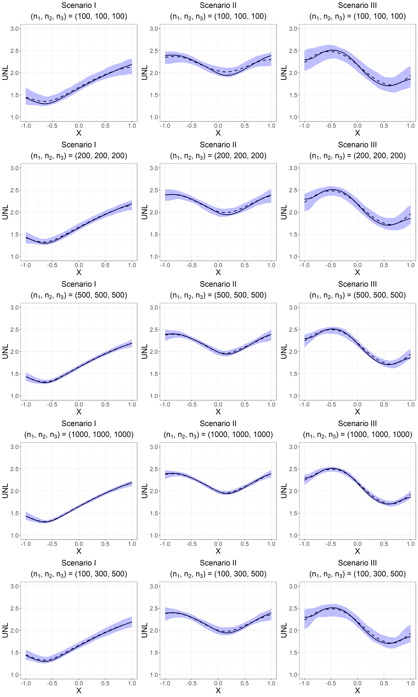
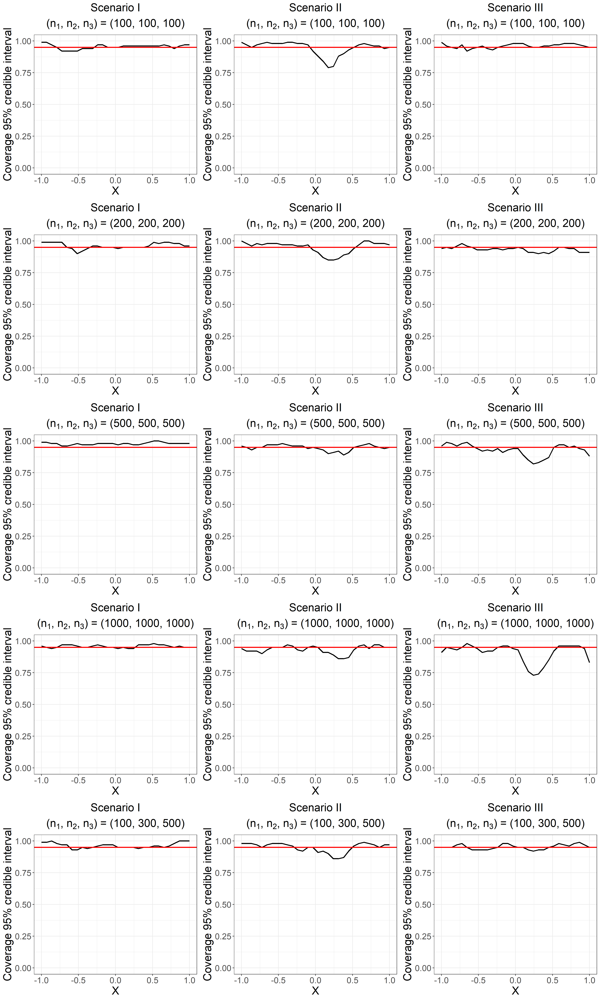

Tutorial for Simulation study in the covariate-specific case in the
paper “The Underlap Coefficient as Measure of a Biomarker’s
Discriminatory Ability”
================
Zhaoxi Zhang, Vanda Inácio, and Miguel de Carvalho

In this tutorial we describe the steps for obtaining the results of the
simulation study in the covariate-specific case in Section 5.2 of the
paper "The Underlap Coefficient as Measure of a Biomarker’s
Discriminatory Ability".

As a preliminary step, we load on a clean environment all the required
libraries.

``` r
library(splines)
library(LSBP)
library(nor1mix)
library(future)
library(future.apply)
library(ggplot2)
```

We need to load some predefined functions for the simulation study in
the covariate-specific case.

``` r
source("../functions/conditional_simulation_functions.R")
```

Because we conduct the estimation of underlap repeatedly for 100
datasets in each scenario, so the process could be accelerated by
parallelizing the computation. Here I use the future package to
demonstrate one way of parallelizing the code, the utilization of the
future package is incorporated in the simulation_unl_con_best function.

``` r
nlist1=list(n1=100,n2=100,n3=100)
nlist2=list(n1=200,n2=200,n3=200)
nlist3=list(n1=500,n2=500,n3=500)
nlist4=list(n1=1000,n2=1000,n3=1000)
nlist5=list(n1=100,n2=300,n3=500)
plan(multisession, workers = parallel::detectCores()-2)

simu_conc1_s1=simulation_unl_con_best(case=1,nlist=nlist1,nrep=100)
simu_conc1_s2=simulation_unl_con_best(case=1,nlist=nlist2,nrep=100)
simu_conc1_s3=simulation_unl_con_best(case=1,nlist=nlist3,nrep=100)
simu_conc1_s4=simulation_unl_con_best(case=1,nlist=nlist4,nrep=100)
simu_conc1_s5=simulation_unl_con_best(case=1,nlist=nlist5,nrep=100)

simu_conc2_s1=simulation_unl_con_best(case=2,nlist=nlist1,nrep=100)
simu_conc2_s2=simulation_unl_con_best(case=2,nlist=nlist2,nrep=100)
simu_conc2_s3=simulation_unl_con_best(case=2,nlist=nlist3,nrep=100)
simu_conc2_s4=simulation_unl_con_best(case=2,nlist=nlist4,nrep=100)
simu_conc2_s5=simulation_unl_con_best(case=2,nlist=nlist5,nrep=100)

simu_conc3_s1=simulation_unl_con_best(case=3,nlist=nlist1,nrep=100)
simu_conc3_s2=simulation_unl_con_best(case=3,nlist=nlist2,nrep=100)
simu_conc3_s3=simulation_unl_con_best(case=3,nlist=nlist3,nrep=100)
simu_conc3_s4=simulation_unl_con_best(case=3,nlist=nlist4,nrep=100)
simu_conc3_s5=simulation_unl_con_best(case=3,nlist=nlist5,nrep=100)
```

We need to use the function tranform_list_simu to transform the results
from future_lapply to a more interpretable manner.

``` r
simu_conc1_s1=tranform_list_simu_con(simu_conc1_s1)
simu_conc1_s2=tranform_list_simu_con(simu_conc1_s2)
simu_conc1_s3=tranform_list_simu_con(simu_conc1_s3)
simu_conc1_s4=tranform_list_simu_con(simu_conc1_s4)
simu_conc1_s5=tranform_list_simu_con(simu_conc1_s5)

simu_conc2_s1=tranform_list_simu_con(simu_conc2_s1)
simu_conc2_s2=tranform_list_simu_con(simu_conc2_s2)
simu_conc2_s3=tranform_list_simu_con(simu_conc2_s3)
simu_conc2_s4=tranform_list_simu_con(simu_conc2_s4)
simu_conc2_s5=tranform_list_simu_con(simu_conc2_s5)

simu_conc3_s1=tranform_list_simu_con(simu_conc3_s1)
simu_conc3_s2=tranform_list_simu_con(simu_conc3_s2)
simu_conc3_s3=tranform_list_simu_con(simu_conc3_s3)
simu_conc3_s4=tranform_list_simu_con(simu_conc3_s4)
simu_conc3_s5=tranform_list_simu_con(simu_conc3_s5)
```

We can then calculate the posterior medians, the 95% quantile intervals
of the posterior medians, the width of the 95% credible intervals, and
the coverage of the 95% credible intervals of UNL estimates in each
scenario.

``` r
##mean of medians
median_conc1_s1=apply(apply(simu_conc1_s1,FUN = median,MARGIN = c(1,3)),FUN = mean,MARGIN = 2)
median_conc1_s2=apply(apply(simu_conc1_s2,FUN = median,MARGIN = c(1,3)),FUN = mean,MARGIN = 2)
median_conc1_s3=apply(apply(simu_conc1_s3,FUN = median,MARGIN = c(1,3)),FUN = mean,MARGIN = 2)
median_conc1_s4=apply(apply(simu_conc1_s4,FUN = median,MARGIN = c(1,3)),FUN = mean,MARGIN = 2)
median_conc1_s5=apply(apply(simu_conc1_s5,FUN = median,MARGIN = c(1,3)),FUN = mean,MARGIN = 2)

median_conc2_s1=apply(apply(simu_conc2_s1,FUN = median,MARGIN = c(1,3)),FUN = mean,MARGIN = 2)
median_conc2_s2=apply(apply(simu_conc2_s2,FUN = median,MARGIN = c(1,3)),FUN = mean,MARGIN = 2)
median_conc2_s3=apply(apply(simu_conc2_s3,FUN = median,MARGIN = c(1,3)),FUN = mean,MARGIN = 2)
median_conc2_s4=apply(apply(simu_conc2_s4,FUN = median,MARGIN = c(1,3)),FUN = mean,MARGIN = 2)
median_conc2_s5=apply(apply(simu_conc2_s5,FUN = median,MARGIN = c(1,3)),FUN = mean,MARGIN = 2)

median_conc3_s1=apply(apply(simu_conc3_s1,FUN = median,MARGIN = c(1,3)),FUN = mean,MARGIN = 2)
median_conc3_s2=apply(apply(simu_conc3_s2,FUN = median,MARGIN = c(1,3)),FUN = mean,MARGIN = 2)
median_conc3_s3=apply(apply(simu_conc3_s3,FUN = median,MARGIN = c(1,3)),FUN = mean,MARGIN = 2)
median_conc3_s4=apply(apply(simu_conc3_s4,FUN = median,MARGIN = c(1,3)),FUN = mean,MARGIN = 2)
median_conc3_s5=apply(apply(simu_conc3_s5,FUN = median,MARGIN = c(1,3)),FUN = mean,MARGIN = 2)


##lower
lower_conc1_s1=apply(apply(simu_conc1_s1,FUN = median,MARGIN = c(1,3)),FUN = quantile, probs=0.025,MARGIN = 2)
lower_conc1_s2=apply(apply(simu_conc1_s2,FUN = median,MARGIN = c(1,3)),FUN = quantile, probs=0.025,MARGIN = 2)
lower_conc1_s3=apply(apply(simu_conc1_s3,FUN = median,MARGIN = c(1,3)),FUN = quantile, probs=0.025,MARGIN = 2)
lower_conc1_s4=apply(apply(simu_conc1_s4,FUN = median,MARGIN = c(1,3)),FUN = quantile, probs=0.025,MARGIN = 2)
lower_conc1_s5=apply(apply(simu_conc1_s5,FUN = median,MARGIN = c(1,3)),FUN = quantile, probs=0.025,MARGIN = 2)

lower_conc2_s1=apply(apply(simu_conc2_s1,FUN = median,MARGIN = c(1,3)),FUN = quantile, probs=0.025,MARGIN = 2)
lower_conc2_s2=apply(apply(simu_conc2_s2,FUN = median,MARGIN = c(1,3)),FUN = quantile, probs=0.025,MARGIN = 2)
lower_conc2_s3=apply(apply(simu_conc2_s3,FUN = median,MARGIN = c(1,3)),FUN = quantile, probs=0.025,MARGIN = 2)
lower_conc2_s4=apply(apply(simu_conc2_s4,FUN = median,MARGIN = c(1,3)),FUN = quantile, probs=0.025,MARGIN = 2)
lower_conc2_s5=apply(apply(simu_conc2_s5,FUN = median,MARGIN = c(1,3)),FUN = quantile, probs=0.025,MARGIN = 2)

lower_conc3_s1=apply(apply(simu_conc3_s1,FUN = median,MARGIN = c(1,3)),FUN = quantile, probs=0.025,MARGIN = 2)
lower_conc3_s2=apply(apply(simu_conc3_s2,FUN = median,MARGIN = c(1,3)),FUN = quantile, probs=0.025,MARGIN = 2)
lower_conc3_s3=apply(apply(simu_conc3_s3,FUN = median,MARGIN = c(1,3)),FUN = quantile, probs=0.025,MARGIN = 2)
lower_conc3_s4=apply(apply(simu_conc3_s4,FUN = median,MARGIN = c(1,3)),FUN = quantile, probs=0.025,MARGIN = 2)
lower_conc3_s5=apply(apply(simu_conc3_s5,FUN = median,MARGIN = c(1,3)),FUN = quantile, probs=0.025,MARGIN = 2)

##higher
higher_conc1_s1=apply(apply(simu_conc1_s1,FUN = median,MARGIN = c(1,3)),FUN = quantile, probs=0.975,MARGIN = 2)
higher_conc1_s2=apply(apply(simu_conc1_s2,FUN = median,MARGIN = c(1,3)),FUN = quantile, probs=0.975,MARGIN = 2)
higher_conc1_s3=apply(apply(simu_conc1_s3,FUN = median,MARGIN = c(1,3)),FUN = quantile, probs=0.975,MARGIN = 2)
higher_conc1_s4=apply(apply(simu_conc1_s4,FUN = median,MARGIN = c(1,3)),FUN = quantile, probs=0.975,MARGIN = 2)
higher_conc1_s5=apply(apply(simu_conc1_s5,FUN = median,MARGIN = c(1,3)),FUN = quantile, probs=0.975,MARGIN = 2)

higher_conc2_s1=apply(apply(simu_conc2_s1,FUN = median,MARGIN = c(1,3)),FUN = quantile, probs=0.975,MARGIN = 2)
higher_conc2_s2=apply(apply(simu_conc2_s2,FUN = median,MARGIN = c(1,3)),FUN = quantile, probs=0.975,MARGIN = 2)
higher_conc2_s3=apply(apply(simu_conc2_s3,FUN = median,MARGIN = c(1,3)),FUN = quantile, probs=0.975,MARGIN = 2)
higher_conc2_s4=apply(apply(simu_conc2_s4,FUN = median,MARGIN = c(1,3)),FUN = quantile, probs=0.975,MARGIN = 2)
higher_conc2_s5=apply(apply(simu_conc2_s5,FUN = median,MARGIN = c(1,3)),FUN = quantile, probs=0.975,MARGIN = 2)

higher_conc3_s1=apply(apply(simu_conc3_s1,FUN = median,MARGIN = c(1,3)),FUN = quantile, probs=0.975,MARGIN = 2)
higher_conc3_s2=apply(apply(simu_conc3_s2,FUN = median,MARGIN = c(1,3)),FUN = quantile, probs=0.975,MARGIN = 2)
higher_conc3_s3=apply(apply(simu_conc3_s3,FUN = median,MARGIN = c(1,3)),FUN = quantile, probs=0.975,MARGIN = 2)
higher_conc3_s4=apply(apply(simu_conc3_s4,FUN = median,MARGIN = c(1,3)),FUN = quantile, probs=0.975,MARGIN = 2)
higher_conc3_s5=apply(apply(simu_conc3_s5,FUN = median,MARGIN = c(1,3)),FUN = quantile, probs=0.975,MARGIN = 2)

#width of CI intervals
width_conc1_s1=apply(apply(simu_conc1_s1,FUN = quantile,probs=0.975,MARGIN = c(1,3))-
                       apply(simu_conc1_s1,FUN = quantile,probs=0.025,MARGIN = c(1,3)),
                     FUN = mean,MARGIN = 2)
width_conc1_s2=apply(apply(simu_conc1_s2,FUN = quantile,probs=0.975,MARGIN = c(1,3))-
                       apply(simu_conc1_s2,FUN = quantile,probs=0.025,MARGIN = c(1,3)),
                     FUN = mean,MARGIN = 2)
width_conc1_s3=apply(apply(simu_conc1_s3,FUN = quantile,probs=0.975,MARGIN = c(1,3))-
                       apply(simu_conc1_s3,FUN = quantile,probs=0.025,MARGIN = c(1,3)),
                     FUN = mean,MARGIN = 2)
width_conc1_s4=apply(apply(simu_conc1_s4,FUN = quantile,probs=0.975,MARGIN = c(1,3))-
                       apply(simu_conc1_s4,FUN = quantile,probs=0.025,MARGIN = c(1,3)),
                     FUN = mean,MARGIN = 2)
width_conc1_s5=apply(apply(simu_conc1_s5,FUN = quantile,probs=0.975,MARGIN = c(1,3))-
                       apply(simu_conc1_s5,FUN = quantile,probs=0.025,MARGIN = c(1,3)),
                     FUN = mean,MARGIN = 2)

width_conc2_s1=apply(apply(simu_conc2_s1,FUN = quantile,probs=0.975,MARGIN = c(1,3))-
                       apply(simu_conc2_s1,FUN = quantile,probs=0.025,MARGIN = c(1,3)),
                     FUN = mean,MARGIN = 2)
width_conc2_s2=apply(apply(simu_conc2_s2,FUN = quantile,probs=0.975,MARGIN = c(1,3))-
                       apply(simu_conc2_s2,FUN = quantile,probs=0.025,MARGIN = c(1,3)),
                     FUN = mean,MARGIN = 2)
width_conc2_s3=apply(apply(simu_conc2_s3,FUN = quantile,probs=0.975,MARGIN = c(1,3))-
                       apply(simu_conc2_s3,FUN = quantile,probs=0.025,MARGIN = c(1,3)),
                     FUN = mean,MARGIN = 2)
width_conc2_s4=apply(apply(simu_conc2_s4,FUN = quantile,probs=0.975,MARGIN = c(1,3))-
                       apply(simu_conc2_s4,FUN = quantile,probs=0.025,MARGIN = c(1,3)),
                     FUN = mean,MARGIN = 2)
width_conc2_s5=apply(apply(simu_conc2_s5,FUN = quantile,probs=0.975,MARGIN = c(1,3))-
                       apply(simu_conc2_s5,FUN = quantile,probs=0.025,MARGIN = c(1,3)),
                     FUN = mean,MARGIN = 2)

width_conc3_s1=apply(apply(simu_conc3_s1,FUN = quantile,probs=0.975,MARGIN = c(1,3))-
                       apply(simu_conc3_s1,FUN = quantile,probs=0.025,MARGIN = c(1,3)),
                     FUN = mean,MARGIN = 2)
width_conc3_s2=apply(apply(simu_conc3_s2,FUN = quantile,probs=0.975,MARGIN = c(1,3))-
                       apply(simu_conc3_s2,FUN = quantile,probs=0.025,MARGIN = c(1,3)),
                     FUN = mean,MARGIN = 2)
width_conc3_s3=apply(apply(simu_conc3_s3,FUN = quantile,probs=0.975,MARGIN = c(1,3))-
                       apply(simu_conc3_s3,FUN = quantile,probs=0.025,MARGIN = c(1,3)),
                     FUN = mean,MARGIN = 2)
width_conc3_s4=apply(apply(simu_conc3_s4,FUN = quantile,probs=0.975,MARGIN = c(1,3))-
                       apply(simu_conc3_s4,FUN = quantile,probs=0.025,MARGIN = c(1,3)),
                     FUN = mean,MARGIN = 2)
width_conc3_s5=apply(apply(simu_conc3_s5,FUN = quantile,probs=0.975,MARGIN = c(1,3))-
                       apply(simu_conc3_s5,FUN = quantile,probs=0.025,MARGIN = c(1,3)),
                     FUN = mean,MARGIN = 2)


x.points =seq(from=-1,to=1,length.out=30)
##examine coverage
true_unl_c1=true_unl_con(case=1,xgrid = x.points)
true_unl_c2=true_unl_con(case=2,xgrid = x.points)
true_unl_c3=true_unl_con(case=3,xgrid = x.points)

higherCI_conc1_s1=apply(simu_conc1_s1,FUN = quantile,probs=0.975,MARGIN = c(1,3))
higherCI_conc1_s2=apply(simu_conc1_s2,FUN = quantile,probs=0.975,MARGIN = c(1,3))
higherCI_conc1_s3=apply(simu_conc1_s3,FUN = quantile,probs=0.975,MARGIN = c(1,3))
higherCI_conc1_s4=apply(simu_conc1_s4,FUN = quantile,probs=0.975,MARGIN = c(1,3))
higherCI_conc1_s5=apply(simu_conc1_s5,FUN = quantile,probs=0.975,MARGIN = c(1,3))

higherCI_conc2_s1=apply(simu_conc2_s1,FUN = quantile,probs=0.975,MARGIN = c(1,3))
higherCI_conc2_s2=apply(simu_conc2_s2,FUN = quantile,probs=0.975,MARGIN = c(1,3))
higherCI_conc2_s3=apply(simu_conc2_s3,FUN = quantile,probs=0.975,MARGIN = c(1,3))
higherCI_conc2_s4=apply(simu_conc2_s4,FUN = quantile,probs=0.975,MARGIN = c(1,3))
higherCI_conc2_s5=apply(simu_conc2_s5,FUN = quantile,probs=0.975,MARGIN = c(1,3))

higherCI_conc3_s1=apply(simu_conc3_s1,FUN = quantile,probs=0.975,MARGIN = c(1,3))
higherCI_conc3_s2=apply(simu_conc3_s2,FUN = quantile,probs=0.975,MARGIN = c(1,3))
higherCI_conc3_s3=apply(simu_conc3_s3,FUN = quantile,probs=0.975,MARGIN = c(1,3))
higherCI_conc3_s4=apply(simu_conc3_s4,FUN = quantile,probs=0.975,MARGIN = c(1,3))
higherCI_conc3_s5=apply(simu_conc3_s5,FUN = quantile,probs=0.975,MARGIN = c(1,3))

lowerCI_conc1_s1=apply(simu_conc1_s1,FUN = quantile,probs=0.025,MARGIN = c(1,3))
lowerCI_conc1_s2=apply(simu_conc1_s2,FUN = quantile,probs=0.025,MARGIN = c(1,3))
lowerCI_conc1_s3=apply(simu_conc1_s3,FUN = quantile,probs=0.025,MARGIN = c(1,3))
lowerCI_conc1_s4=apply(simu_conc1_s4,FUN = quantile,probs=0.025,MARGIN = c(1,3))
lowerCI_conc1_s5=apply(simu_conc1_s5,FUN = quantile,probs=0.025,MARGIN = c(1,3))

lowerCI_conc2_s1=apply(simu_conc2_s1,FUN = quantile,probs=0.025,MARGIN = c(1,3))
lowerCI_conc2_s2=apply(simu_conc2_s2,FUN = quantile,probs=0.025,MARGIN = c(1,3))
lowerCI_conc2_s3=apply(simu_conc2_s3,FUN = quantile,probs=0.025,MARGIN = c(1,3))
lowerCI_conc2_s4=apply(simu_conc2_s4,FUN = quantile,probs=0.025,MARGIN = c(1,3))
lowerCI_conc2_s5=apply(simu_conc2_s5,FUN = quantile,probs=0.025,MARGIN = c(1,3))

lowerCI_conc3_s1=apply(simu_conc3_s1,FUN = quantile,probs=0.025,MARGIN = c(1,3))
lowerCI_conc3_s2=apply(simu_conc3_s2,FUN = quantile,probs=0.025,MARGIN = c(1,3))
lowerCI_conc3_s3=apply(simu_conc3_s3,FUN = quantile,probs=0.025,MARGIN = c(1,3))
lowerCI_conc3_s4=apply(simu_conc3_s4,FUN = quantile,probs=0.025,MARGIN = c(1,3))
lowerCI_conc3_s5=apply(simu_conc3_s5,FUN = quantile,probs=0.025,MARGIN = c(1,3))

examine_coverage<-function(true_unl_c1,higherCI_conc1_s1,lowerCI_conc1_s1){
  nrep=dim(higherCI_conc1_s1)[1];xlength=dim(higherCI_conc1_s1)[2]
  temp=matrix(0,nrow=nrep,ncol=xlength)
  for(i in 1:nrep){
    #i=1
    temp[i,]=true_unl_c1<=higherCI_conc1_s1[i,]&true_unl_c1>=lowerCI_conc1_s1[i,]
  }
  return(temp)
}


coverage_conc1_s1=apply(examine_coverage(true_unl_c1,higherCI_conc1_s1,lowerCI_conc1_s1),MARGIN =2,FUN = sum)/100
coverage_conc1_s2=apply(examine_coverage(true_unl_c1,higherCI_conc1_s2,lowerCI_conc1_s2),MARGIN =2,FUN = sum)/100
coverage_conc1_s3=apply(examine_coverage(true_unl_c1,higherCI_conc1_s3,lowerCI_conc1_s3),MARGIN =2,FUN = sum)/100
coverage_conc1_s4=apply(examine_coverage(true_unl_c1,higherCI_conc1_s4,lowerCI_conc1_s4),MARGIN =2,FUN = sum)/100
coverage_conc1_s5=apply(examine_coverage(true_unl_c1,higherCI_conc1_s5,lowerCI_conc1_s5),MARGIN =2,FUN = sum)/100

coverage_conc2_s1=apply(examine_coverage(true_unl_c2,higherCI_conc2_s1,lowerCI_conc2_s1),MARGIN =2,FUN = sum)/100
coverage_conc2_s2=apply(examine_coverage(true_unl_c2,higherCI_conc2_s2,lowerCI_conc2_s2),MARGIN =2,FUN = sum)/100
coverage_conc2_s3=apply(examine_coverage(true_unl_c2,higherCI_conc2_s3,lowerCI_conc2_s3),MARGIN =2,FUN = sum)/100
coverage_conc2_s4=apply(examine_coverage(true_unl_c2,higherCI_conc2_s4,lowerCI_conc2_s4),MARGIN =2,FUN = sum)/100
coverage_conc2_s5=apply(examine_coverage(true_unl_c2,higherCI_conc2_s5,lowerCI_conc2_s5),MARGIN =2,FUN = sum)/100

coverage_conc3_s1=apply(examine_coverage(true_unl_c3,higherCI_conc3_s1,lowerCI_conc3_s1),MARGIN =2,FUN = sum)/100
coverage_conc3_s2=apply(examine_coverage(true_unl_c3,higherCI_conc3_s2,lowerCI_conc3_s2),MARGIN =2,FUN = sum)/100
coverage_conc3_s3=apply(examine_coverage(true_unl_c3,higherCI_conc3_s3,lowerCI_conc3_s3),MARGIN =2,FUN = sum)/100
coverage_conc3_s4=apply(examine_coverage(true_unl_c3,higherCI_conc3_s4,lowerCI_conc3_s4),MARGIN =2,FUN = sum)/100
coverage_conc3_s5=apply(examine_coverage(true_unl_c3,higherCI_conc3_s5,lowerCI_conc3_s5),MARGIN =2,FUN = sum)/100

plot_con_data=data.frame(x.points=x.points,true_unl_c1=true_unl_con(case=1,xgrid = x.points),
                         true_unl_c2=true_unl_con(case=2,xgrid = x.points),
                         true_unl_c3=true_unl_con(case=3,xgrid = x.points),
                         median_conc1_s1=median_conc1_s1,median_conc1_s2=median_conc1_s2,
                         median_conc1_s3=median_conc1_s3,median_conc1_s4=median_conc1_s4,
                         median_conc1_s5=median_conc1_s5,
                         lower_conc1_s1=lower_conc1_s1,lower_conc1_s2=lower_conc1_s2,
                         lower_conc1_s3=lower_conc1_s3,lower_conc1_s4=lower_conc1_s4,
                         lower_conc1_s5=lower_conc1_s5,
                         higher_conc1_s1=higher_conc1_s1,higher_conc1_s2=higher_conc1_s2,
                         higher_conc1_s3=higher_conc1_s3,higher_conc1_s4=higher_conc1_s4,
                         higher_conc1_s5=higher_conc1_s5,
                         median_conc2_s1=median_conc2_s1,median_conc2_s2=median_conc2_s2,
                         median_conc2_s3=median_conc2_s3,median_conc2_s4=median_conc2_s4,
                         median_conc2_s5=median_conc2_s5,
                         lower_conc2_s1=lower_conc2_s1,lower_conc2_s2=lower_conc2_s2,
                         lower_conc2_s3=lower_conc2_s3,lower_conc2_s4=lower_conc2_s4,
                         lower_conc2_s5=lower_conc2_s5,
                         higher_conc2_s1=higher_conc2_s1,higher_conc2_s2=higher_conc2_s2,
                         higher_conc2_s3=higher_conc2_s3,higher_conc2_s4=higher_conc2_s4,
                         higher_conc2_s5=higher_conc2_s5,
                         median_conc3_s1=median_conc3_s1,median_conc3_s2=median_conc3_s2,
                         median_conc3_s3=median_conc3_s3,median_conc3_s4=median_conc3_s4,
                         median_conc3_s5=median_conc3_s5,
                         lower_conc3_s1=lower_conc3_s1,lower_conc3_s2=lower_conc3_s2,
                         lower_conc3_s3=lower_conc3_s3,lower_conc3_s4=lower_conc3_s4,
                         lower_conc3_s5=lower_conc3_s5,
                         higher_conc3_s1=higher_conc3_s1,higher_conc3_s2=higher_conc3_s2,
                         higher_conc3_s3=higher_conc3_s3,higher_conc3_s4=higher_conc3_s4,
                         higher_conc3_s5=higher_conc3_s5
                         
)
plot_con_coverage=data.frame(x.points=x.points,
                             coverage_conc1_s1=coverage_conc1_s1,coverage_conc1_s2=coverage_conc1_s2,
                             coverage_conc1_s3=coverage_conc1_s3,coverage_conc1_s4=coverage_conc1_s4,
                             coverage_conc1_s5=coverage_conc1_s5,
                             coverage_conc2_s1=coverage_conc2_s1,coverage_conc2_s2=coverage_conc2_s2,
                             coverage_conc2_s3=coverage_conc2_s3,coverage_conc2_s4=coverage_conc2_s4,
                             coverage_conc2_s5=coverage_conc2_s5,
                             coverage_conc3_s1=coverage_conc3_s1,coverage_conc3_s2=coverage_conc3_s2,
                             coverage_conc3_s3=coverage_conc3_s3,coverage_conc3_s4=coverage_conc3_s4,
                             coverage_conc3_s5=coverage_conc3_s5)
plot_con_width=data.frame(x.points=x.points,
                          width_conc1_s1=width_conc1_s1,width_conc1_s2=width_conc1_s2,
                          width_conc1_s3=width_conc1_s3,width_conc1_s4=width_conc1_s4,
                          width_conc1_s5=width_conc1_s5,
                          width_conc1_s1=width_conc1_s1,width_conc1_s2=width_conc1_s2,
                          width_conc1_s3=width_conc1_s3,width_conc1_s4=width_conc1_s4,
                          width_conc1_s5=width_conc1_s5,
                          width_conc1_s1=width_conc1_s1,width_conc1_s2=width_conc1_s2,
                          width_conc1_s3=width_conc1_s3,width_conc1_s4=width_conc1_s4,
                          width_conc1_s5=width_conc1_s5)
```

## Posterior median plots

We can then compare of the posterior median of the coefficient of
underlap across 100 simulated datasets with the underlying true underlap
values for different parameter configurations and sample sizes as
following.

``` r
theme_set(theme_bw())
plot_con_c1_s1=ggplot() +
  geom_line(aes(x.points,true_unl_c1 ),linewidth=1,color="black") +
  geom_line(aes(x.points,median_conc1_s1 ),linewidth=1,color="black",linetype = "dashed") +
  geom_ribbon(aes(x = x.points, ymin = lower_conc1_s1, ymax = higher_conc1_s1), alpha = 0.25,fill="blue")+
  xlab("X")+ylab("UNL")+
  scale_x_continuous(breaks =  seq(-1,1,by=0.5))+
  scale_y_continuous(breaks =  seq(1,3,by=0.5),limits = c(1,3))+
  ggtitle(expression(atop("Scenario I", paste("(n"[1], ", n"[2], ", n"[3], ") = (100, 100, 100)"))))+
  theme(
    plot.title = element_text(size = 20, face = "bold", hjust = 0.5),
    axis.title = element_text(size = 20),
    axis.text = element_text(size = 15)
  )

plot_con_c1_s2=ggplot() +
  geom_line(aes(x.points,true_unl_c1 ),linewidth=1,color="black") +
  geom_line(aes(x.points,median_conc1_s2 ),linewidth=1,color="black",linetype = "dashed") +
  geom_ribbon(aes(x = x.points, ymin = lower_conc1_s2, ymax = higher_conc1_s2), alpha = 0.25,fill="blue")+
  xlab("X")+ylab("UNL")+
  scale_x_continuous(breaks =  seq(-1,1,by=0.5))+
  scale_y_continuous(breaks =  seq(1,3,by=0.5),limits = c(1,3))+
  ggtitle(expression(atop("Scenario I", paste("(n"[1], ", n"[2], ", n"[3], ") = (200, 200, 200)"))))+
  theme(
    plot.title = element_text(size = 20, face = "bold", hjust = 0.5),
    axis.title = element_text(size = 20),
    axis.text = element_text(size = 15)
  )

plot_con_c1_s3=ggplot() +
  geom_line(aes(x.points,true_unl_c1 ),linewidth=1,color="black") +
  geom_line(aes(x.points,median_conc1_s3 ),linewidth=1,color="black",linetype = "dashed") +
  geom_ribbon(aes(x = x.points, ymin = lower_conc1_s3, ymax = higher_conc1_s3), alpha = 0.25,fill="blue")+
  xlab("X")+ylab("UNL")+
  scale_x_continuous(breaks =  seq(-1,1,by=0.5))+
  scale_y_continuous(breaks =  seq(1,3,by=0.5),limits = c(1,3))+
  ggtitle(expression(atop("Scenario I", paste("(n"[1], ", n"[2], ", n"[3], ") = (500, 500, 500)"))))+
  theme(
    plot.title = element_text(size = 20, face = "bold", hjust = 0.5),
    axis.title = element_text(size = 20),
    axis.text = element_text(size = 15)
  )

plot_con_c1_s4=ggplot() +
  geom_line(aes(x.points,true_unl_c1 ),linewidth=1,color="black") +
  geom_line(aes(x.points,median_conc1_s4 ),linewidth=1,color="black",linetype = "dashed") +
  geom_ribbon(aes(x = x.points, ymin = lower_conc1_s4, ymax = higher_conc1_s4), alpha = 0.25,fill="blue")+
  xlab("X")+ylab("UNL")+
  scale_x_continuous(breaks =  seq(-1,1,by=0.5))+
  scale_y_continuous(breaks =  seq(1,3,by=0.5),limits = c(1,3))+
  ggtitle(expression(atop("Scenario I", paste("(n"[1], ", n"[2], ", n"[3], ") = (1000, 1000, 1000)"))))+
  theme(
    plot.title = element_text(size = 20, face = "bold", hjust = 0.5),
    axis.title = element_text(size = 20),
    axis.text = element_text(size = 15)
  )

plot_con_c1_s5=ggplot() +
  geom_line(aes(x.points,true_unl_c1 ),linewidth=1,color="black") +
  geom_line(aes(x.points,median_conc1_s5 ),linewidth=1,color="black",linetype = "dashed") +
  geom_ribbon(aes(x = x.points, ymin = lower_conc1_s5, ymax = higher_conc1_s5), alpha = 0.25,fill="blue")+
  xlab("X")+ylab("UNL")+
  scale_x_continuous(breaks =  seq(-1,1,by=0.5))+
  scale_y_continuous(breaks =  seq(1,3,by=0.5),limits = c(1,3))+
  ggtitle(expression(atop("Scenario I", paste("(n"[1], ", n"[2], ", n"[3], ") = (100, 300, 500)"))))+
  theme(
    plot.title = element_text(size = 20, face = "bold", hjust = 0.5),
    axis.title = element_text(size = 20),
    axis.text = element_text(size = 15)
  )

##c2
plot_con_c2_s1=ggplot() +
  geom_line(aes(x.points,true_unl_c2 ),linewidth=1,color="black") +
  geom_line(aes(x.points,median_conc2_s1 ),linewidth=1,color="black",linetype = "dashed") +
  geom_ribbon(aes(x = x.points, ymin = lower_conc2_s1, ymax = higher_conc2_s1), alpha = 0.25,fill="blue")+
  xlab("X")+ylab("UNL")+
  scale_x_continuous(breaks =  seq(-1,1,by=0.5))+
  scale_y_continuous(breaks =  seq(1,3,by=0.5),limits = c(1,3))+
  ggtitle(expression(atop("Scenario II", paste("(n"[1], ", n"[2], ", n"[3], ") = (100, 100, 100)"))))+
  theme(
    plot.title = element_text(size = 20, face = "bold", hjust = 0.5),
    axis.title = element_text(size = 20),
    axis.text = element_text(size = 15)
  )

plot_con_c2_s2=ggplot() +
  geom_line(aes(x.points,true_unl_c2 ),linewidth=1,color="black") +
  geom_line(aes(x.points,median_conc2_s2 ),linewidth=1,color="black",linetype = "dashed") +
  geom_ribbon(aes(x = x.points, ymin = lower_conc2_s2, ymax = higher_conc2_s2), alpha = 0.25,fill="blue")+
  xlab("X")+ylab("UNL")+
  scale_x_continuous(breaks =  seq(-1,1,by=0.5))+
  scale_y_continuous(breaks =  seq(1,3,by=0.5),limits = c(1,3))+
  ggtitle(expression(atop("Scenario II", paste("(n"[1], ", n"[2], ", n"[3], ") = (200, 200, 200)"))))+
  theme(
    plot.title = element_text(size = 20, face = "bold", hjust = 0.5),
    axis.title = element_text(size = 20),
    axis.text = element_text(size = 15)
  )

plot_con_c2_s3=ggplot() +
  geom_line(aes(x.points,true_unl_c2 ),linewidth=1,color="black") +
  geom_line(aes(x.points,median_conc2_s3 ),linewidth=1,color="black",linetype = "dashed") +
  geom_ribbon(aes(x = x.points, ymin = lower_conc2_s3, ymax = higher_conc2_s3), alpha = 0.25,fill="blue")+
  xlab("X")+ylab("UNL")+
  scale_x_continuous(breaks =  seq(-1,1,by=0.5))+
  scale_y_continuous(breaks =  seq(1,3,by=0.5),limits = c(1,3))+
  ggtitle(expression(atop("Scenario II", paste("(n"[1], ", n"[2], ", n"[3], ") = (500, 500, 500)"))))+
  theme(
    plot.title = element_text(size = 20, face = "bold", hjust = 0.5),
    axis.title = element_text(size = 20),
    axis.text = element_text(size = 15)
  )

plot_con_c2_s4=ggplot() +
  geom_line(aes(x.points,true_unl_c2 ),linewidth=1,color="black") +
  geom_line(aes(x.points,median_conc2_s4 ),linewidth=1,color="black",linetype = "dashed") +
  geom_ribbon(aes(x = x.points, ymin = lower_conc2_s4, ymax = higher_conc2_s4), alpha = 0.25,fill="blue")+
  xlab("X")+ylab("UNL")+
  scale_x_continuous(breaks =  seq(-1,1,by=0.5))+
  scale_y_continuous(breaks =  seq(1,3,by=0.5),limits = c(1,3))+
  ggtitle(expression(atop("Scenario II", paste("(n"[1], ", n"[2], ", n"[3], ") = (1000, 1000, 1000)"))))+
  theme(
    plot.title = element_text(size = 20, face = "bold", hjust = 0.5),
    axis.title = element_text(size = 20),
    axis.text = element_text(size = 15)
  )

plot_con_c2_s5=ggplot() +
  geom_line(aes(x.points,true_unl_c2 ),linewidth=1,color="black") +
  geom_line(aes(x.points,median_conc2_s5 ),linewidth=1,color="black",linetype = "dashed") +
  geom_ribbon(aes(x = x.points, ymin = lower_conc2_s5, ymax = higher_conc2_s5), alpha = 0.25,fill="blue")+
  xlab("X")+ylab("UNL")+
  scale_x_continuous(breaks =  seq(-1,1,by=0.5))+
  scale_y_continuous(breaks =  seq(1,3,by=0.5),limits = c(1,3))+
  ggtitle(expression(atop("Scenario II", paste("(n"[1], ", n"[2], ", n"[3], ") = (100, 300, 500)"))))+
  theme(
    plot.title = element_text(size = 20, face = "bold", hjust = 0.5),
    axis.title = element_text(size = 20),
    axis.text = element_text(size = 15)
  )

##C3
plot_con_c3_s1=ggplot() +
  geom_line(aes(x.points,true_unl_c3 ),linewidth=1,color="black") +
  geom_line(aes(x.points,median_conc3_s1 ),linewidth=1,color="black",linetype = "dashed") +
  geom_ribbon(aes(x = x.points, ymin = lower_conc3_s1, ymax = higher_conc3_s1), alpha = 0.25,fill="blue")+
  xlab("X")+ylab("UNL")+
  scale_x_continuous(breaks =  seq(-1,1,by=0.5))+
  scale_y_continuous(breaks =  seq(1,3,by=0.5),limits = c(1,3))+
  ggtitle(expression(atop("Scenario III", paste("(n"[1], ", n"[2], ", n"[3], ") = (100, 100, 100)"))))+
  theme(
    plot.title = element_text(size = 20, face = "bold", hjust = 0.5),
    axis.title = element_text(size = 20),
    axis.text = element_text(size = 15)
  )

plot_con_c3_s2=ggplot() +
  geom_line(aes(x.points,true_unl_c3 ),linewidth=1,color="black") +
  geom_line(aes(x.points,median_conc3_s2 ),linewidth=1,color="black",linetype = "dashed") +
  geom_ribbon(aes(x = x.points, ymin = lower_conc3_s2, ymax = higher_conc3_s2), alpha = 0.25,fill="blue")+
  xlab("X")+ylab("UNL")+
  scale_x_continuous(breaks =  seq(-1,1,by=0.5))+
  scale_y_continuous(breaks =  seq(1,3,by=0.5),limits = c(1,3))+
  ggtitle(expression(atop("Scenario III", paste("(n"[1], ", n"[2], ", n"[3], ") = (200, 200, 200)"))))+
  theme(
    plot.title = element_text(size = 20, face = "bold", hjust = 0.5),
    axis.title = element_text(size = 20),
    axis.text = element_text(size = 15)
  )

plot_con_c3_s3=ggplot() +
  geom_line(aes(x.points,true_unl_c3 ),linewidth=1,color="black") +
  geom_line(aes(x.points,median_conc3_s3 ),linewidth=1,color="black",linetype = "dashed") +
  geom_ribbon(aes(x = x.points, ymin = lower_conc3_s3, ymax = higher_conc3_s3), alpha = 0.25,fill="blue")+
  xlab("X")+ylab("UNL")+
  scale_x_continuous(breaks =  seq(-1,1,by=0.5))+
  scale_y_continuous(breaks =  seq(1,3,by=0.5),limits = c(1,3))+
  ggtitle(expression(atop("Scenario III", paste("(n"[1], ", n"[2], ", n"[3], ") = (500, 500, 500)"))))+
  theme(
    plot.title = element_text(size = 20, face = "bold", hjust = 0.5),
    axis.title = element_text(size = 20),
    axis.text = element_text(size = 15)
  )

plot_con_c3_s4=ggplot() +
  geom_line(aes(x.points,true_unl_c3 ),linewidth=1,color="black") +
  geom_line(aes(x.points,median_conc3_s4 ),linewidth=1,color="black",linetype = "dashed") +
  geom_ribbon(aes(x = x.points, ymin = lower_conc3_s4, ymax = higher_conc3_s4), alpha = 0.25,fill="blue")+
  xlab("X")+ylab("UNL")+
  scale_x_continuous(breaks =  seq(-1,1,by=0.5))+
  scale_y_continuous(breaks =  seq(1,3,by=0.5),limits = c(1,3))+
  ggtitle(expression(atop("Scenario III", paste("(n"[1], ", n"[2], ", n"[3], ") = (1000, 1000, 1000)"))))+
  theme(
    plot.title = element_text(size = 20, face = "bold", hjust = 0.5),
    axis.title = element_text(size = 20),
    axis.text = element_text(size = 15)
  )

plot_con_c3_s5=ggplot() +
  geom_line(aes(x.points,true_unl_c3 ),linewidth=1,color="black") +
  geom_line(aes(x.points,median_conc3_s5 ),linewidth=1,color="black",linetype = "dashed") +
  geom_ribbon(aes(x = x.points, ymin = lower_conc3_s5, ymax = higher_conc3_s5), alpha = 0.25,fill="blue")+
  xlab("X")+ylab("UNL")+
  scale_x_continuous(breaks =  seq(-1,1,by=0.5))+
  scale_y_continuous(breaks =  seq(1,3,by=0.5),limits = c(1,3))+
  ggtitle(expression(atop("Scenario III", paste("(n"[1], ", n"[2], ", n"[3], ") = (100, 300, 500)"))))+
  theme(
    plot.title = element_text(size = 20, face = "bold", hjust = 0.5),
    axis.title = element_text(size = 20),
    axis.text = element_text(size = 15)
  )
```

``` r
cowplot::plot_grid(plot_con_c1_s1,plot_con_c1_s2,plot_con_c1_s3,plot_con_c1_s4,plot_con_c1_s5,
                   plot_con_c2_s1,plot_con_c2_s2,plot_con_c2_s3,plot_con_c2_s4,plot_con_c2_s5,
                   plot_con_c3_s1,plot_con_c3_s2,plot_con_c3_s3,plot_con_c3_s4,plot_con_c3_s5,
                   byrow = FALSE,ncol = 3)
```

<!-- -->

## Coverage vs covariate plots

We can show the empirical coverage 95% credible intervals of the
coefficient of underlap across 100 simulated datasets for varying
parameter configurations and sample sizes as following.

``` r
plot_con_coverage_c1_s1=ggplot(plot_con_coverage) +
  geom_line(aes(x.points, coverage_conc1_s1 ),linewidth=1,color="black") +
  geom_hline(yintercept = 0.95, color = "red",linewidth=1) +
  xlab("X")+ylab("Coverage 95% credible interval")+
  scale_x_continuous(breaks =  seq(-1,1,by=0.5))+
  scale_y_continuous(breaks =  seq(0,1,by=0.25),limits = c(0,1))+
  ggtitle(expression(atop("Scenario I", paste("(n"[1], ", n"[2], ", n"[3], ") = (100, 100, 100)"))))+
  theme(
    plot.title = element_text(size = 20, face = "bold", hjust = 0.5),
    axis.title = element_text(size = 20),
    axis.text = element_text(size = 15)
  )

plot_con_coverage_c1_s2=ggplot(plot_con_coverage) +
  geom_line(aes(x.points, coverage_conc1_s2 ),linewidth=1,color="black") +
  geom_hline(yintercept = 0.95, color = "red",linewidth=1) +
  xlab("X")+ylab("Coverage 95% credible interval")+
  scale_x_continuous(breaks =  seq(-1,1,by=0.5))+
  scale_y_continuous(breaks =  seq(0,1,by=0.25),limits = c(0,1))+
  ggtitle(expression(atop("Scenario I", paste("(n"[1], ", n"[2], ", n"[3], ") = (200, 200, 200)"))))+
  theme(
    plot.title = element_text(size = 20, face = "bold", hjust = 0.5),
    axis.title = element_text(size = 20),
    axis.text = element_text(size = 15)
  )

plot_con_coverage_c1_s3=ggplot(plot_con_coverage) +
  geom_line(aes(x.points, coverage_conc1_s3 ),linewidth=1,color="black") +
  geom_hline(yintercept = 0.95, color = "red",linewidth=1) +
  xlab("X")+ylab("Coverage 95% credible interval")+
  scale_x_continuous(breaks =  seq(-1,1,by=0.5))+
  scale_y_continuous(breaks =  seq(0,1,by=0.25),limits = c(0,1))+
  ggtitle(expression(atop("Scenario I", paste("(n"[1], ", n"[2], ", n"[3], ") = (500, 500, 500)"))))+
  theme(
    plot.title = element_text(size = 20, face = "bold", hjust = 0.5),
    axis.title = element_text(size = 20),
    axis.text = element_text(size = 15)
  )

plot_con_coverage_c1_s4=ggplot(plot_con_coverage) +
  geom_line(aes(x.points, coverage_conc1_s4 ),linewidth=1,color="black") +
  geom_hline(yintercept = 0.95, color = "red",linewidth=1) +
  xlab("X")+ylab("Coverage 95% credible interval")+
  scale_x_continuous(breaks =  seq(-1,1,by=0.5))+
  scale_y_continuous(breaks =  seq(0,1,by=0.25),limits = c(0,1))+
  ggtitle(expression(atop("Scenario I", paste("(n"[1], ", n"[2], ", n"[3], ") = (1000, 1000, 1000)"))))+
  theme(
    plot.title = element_text(size = 20, face = "bold", hjust = 0.5),
    axis.title = element_text(size = 20),
    axis.text = element_text(size = 15)
  )

plot_con_coverage_c1_s5=ggplot(plot_con_coverage) +
  geom_line(aes(x.points, coverage_conc1_s5 ),linewidth=1,color="black") +
  geom_hline(yintercept = 0.95, color = "red",linewidth=1) +
  xlab("X")+ylab("Coverage 95% credible interval")+
  scale_x_continuous(breaks =  seq(-1,1,by=0.5))+
  scale_y_continuous(breaks =  seq(0,1,by=0.25),limits = c(0,1))+
  ggtitle(expression(atop("Scenario I", paste("(n"[1], ", n"[2], ", n"[3], ") = (100, 300, 500)"))))+
  theme(
    plot.title = element_text(size = 20, face = "bold", hjust = 0.5),
    axis.title = element_text(size = 20),
    axis.text = element_text(size = 15)
  )

##c2
plot_con_coverage_c2_s1=ggplot(plot_con_coverage) +
  geom_line(aes(x.points, coverage_conc2_s1 ),linewidth=1,color="black") +
  geom_hline(yintercept = 0.95, color = "red",linewidth=1) +
  xlab("X")+ylab("Coverage 95% credible interval")+
  scale_x_continuous(breaks =  seq(-1,1,by=0.5))+
  scale_y_continuous(breaks =  seq(0,1,by=0.25),limits = c(0,1))+
  ggtitle(expression(atop("Scenario II", paste("(n"[1], ", n"[2], ", n"[3], ") = (100, 100, 100)"))))+
  theme(
    plot.title = element_text(size = 20, face = "bold", hjust = 0.5),
    axis.title = element_text(size = 20),
    axis.text = element_text(size = 15)
  )

plot_con_coverage_c2_s2=ggplot(plot_con_coverage) +
  geom_line(aes(x.points, coverage_conc2_s2 ),linewidth=1,color="black") +
  geom_hline(yintercept = 0.95, color = "red",linewidth=1) +
  xlab("X")+ylab("Coverage 95% credible interval")+
  scale_x_continuous(breaks =  seq(-1,1,by=0.5))+
  scale_y_continuous(breaks =  seq(0,1,by=0.25),limits = c(0,1))+
  ggtitle(expression(atop("Scenario II", paste("(n"[1], ", n"[2], ", n"[3], ") = (200, 200, 200)"))))+
  theme(
    plot.title = element_text(size = 20, face = "bold", hjust = 0.5),
    axis.title = element_text(size = 20),
    axis.text = element_text(size = 15)
  )

plot_con_coverage_c2_s3=ggplot(plot_con_coverage) +
  geom_line(aes(x.points, coverage_conc2_s3 ),linewidth=1,color="black") +
  geom_hline(yintercept = 0.95, color = "red",linewidth=1) +
  xlab("X")+ylab("Coverage 95% credible interval")+
  scale_x_continuous(breaks =  seq(-1,1,by=0.5))+
  scale_y_continuous(breaks =  seq(0,1,by=0.25),limits = c(0,1))+
  ggtitle(expression(atop("Scenario II", paste("(n"[1], ", n"[2], ", n"[3], ") = (500, 500, 500)"))))+
  theme(
    plot.title = element_text(size = 20, face = "bold", hjust = 0.5),
    axis.title = element_text(size = 20),
    axis.text = element_text(size = 15)
  )

plot_con_coverage_c2_s4=ggplot(plot_con_coverage) +
  geom_line(aes(x.points, coverage_conc2_s4 ),linewidth=1,color="black") +
  geom_hline(yintercept = 0.95, color = "red",linewidth=1) +
  xlab("X")+ylab("Coverage 95% credible interval")+
  scale_x_continuous(breaks =  seq(-1,1,by=0.5))+
  scale_y_continuous(breaks =  seq(0,1,by=0.25),limits = c(0,1))+
  ggtitle(expression(atop("Scenario II", paste("(n"[1], ", n"[2], ", n"[3], ") = (1000, 1000, 1000)"))))+
  theme(
    plot.title = element_text(size = 20, face = "bold", hjust = 0.5),
    axis.title = element_text(size = 20),
    axis.text = element_text(size = 15)
  )

plot_con_coverage_c2_s5=ggplot(plot_con_coverage) +
  geom_line(aes(x.points, coverage_conc2_s5 ),linewidth=1,color="black") +
  geom_hline(yintercept = 0.95, color = "red",linewidth=1) +
  xlab("X")+ylab("Coverage 95% credible interval")+
  scale_x_continuous(breaks =  seq(-1,1,by=0.5))+
  scale_y_continuous(breaks =  seq(0,1,by=0.25),limits = c(0,1))+
  ggtitle(expression(atop("Scenario II", paste("(n"[1], ", n"[2], ", n"[3], ") = (100, 300, 500)"))))+
  theme(
    plot.title = element_text(size = 20, face = "bold", hjust = 0.5),
    axis.title = element_text(size = 20),
    axis.text = element_text(size = 15)
  )

##c3
plot_con_coverage_c3_s1=ggplot(plot_con_coverage) +
  geom_line(aes(x.points, coverage_conc3_s1 ),linewidth=1,color="black") +
  geom_hline(yintercept = 0.95, color = "red",linewidth=1) +
  xlab("X")+ylab("Coverage 95% credible interval")+
  scale_x_continuous(breaks =  seq(-1,1,by=0.5))+
  scale_y_continuous(breaks =  seq(0,1,by=0.25),limits = c(0,1))+
  ggtitle(expression(atop("Scenario III", paste("(n"[1], ", n"[2], ", n"[3], ") = (100, 100, 100)"))))+
  theme(
    plot.title = element_text(size = 20, face = "bold", hjust = 0.5),
    axis.title = element_text(size = 20),
    axis.text = element_text(size = 15)
  )

plot_con_coverage_c3_s2=ggplot(plot_con_coverage) +
  geom_line(aes(x.points, coverage_conc3_s2 ),linewidth=1,color="black") +
  geom_hline(yintercept = 0.95, color = "red",linewidth=1) +
  xlab("X")+ylab("Coverage 95% credible interval")+
  scale_x_continuous(breaks =  seq(-1,1,by=0.5))+
  scale_y_continuous(breaks =  seq(0,1,by=0.25),limits = c(0,1))+
  ggtitle(expression(atop("Scenario III", paste("(n"[1], ", n"[2], ", n"[3], ") = (200, 200, 200)"))))+
  theme(
    plot.title = element_text(size = 20, face = "bold", hjust = 0.5),
    axis.title = element_text(size = 20),
    axis.text = element_text(size = 15)
  )

plot_con_coverage_c3_s3=ggplot(plot_con_coverage) +
  geom_line(aes(x.points, coverage_conc3_s3 ),linewidth=1,color="black") +
  geom_hline(yintercept = 0.95, color = "red",linewidth=1) +
  xlab("X")+ylab("Coverage 95% credible interval")+
  scale_x_continuous(breaks =  seq(-1,1,by=0.5))+
  scale_y_continuous(breaks =  seq(0,1,by=0.25),limits = c(0,1))+
  ggtitle(expression(atop("Scenario III", paste("(n"[1], ", n"[2], ", n"[3], ") = (500, 500, 500)"))))+
  theme(
    plot.title = element_text(size = 20, face = "bold", hjust = 0.5),
    axis.title = element_text(size = 20),
    axis.text = element_text(size = 15)
  )

plot_con_coverage_c3_s4=ggplot(plot_con_coverage) +
  geom_line(aes(x.points, coverage_conc3_s4 ),linewidth=1,color="black") +
  geom_hline(yintercept = 0.95, color = "red",linewidth=1) +
  xlab("X")+ylab("Coverage 95% credible interval")+
  scale_x_continuous(breaks =  seq(-1,1,by=0.5))+
  scale_y_continuous(breaks =  seq(0,1,by=0.25),limits = c(0,1))+
  ggtitle(expression(atop("Scenario III", paste("(n"[1], ", n"[2], ", n"[3], ") = (1000, 1000, 1000)"))))+
  theme(
    plot.title = element_text(size = 20, face = "bold", hjust = 0.5),
    axis.title = element_text(size = 20),
    axis.text = element_text(size = 15)
  )

plot_con_coverage_c3_s5=ggplot(plot_con_coverage) +
  geom_line(aes(x.points, coverage_conc3_s5 ),linewidth=1,color="black") +
  geom_hline(yintercept = 0.95, color = "red",linewidth=1) +
  xlab("X")+ylab("Coverage 95% credible interval")+
  scale_x_continuous(breaks =  seq(-1,1,by=0.5))+
  scale_y_continuous(breaks =  seq(0,1,by=0.25),limits = c(0,1))+
  ggtitle(expression(atop("Scenario III", paste("(n"[1], ", n"[2], ", n"[3], ") = (100, 300, 500)"))))+
  theme(
    plot.title = element_text(size = 20, face = "bold", hjust = 0.5),
    axis.title = element_text(size = 20),
    axis.text = element_text(size = 15)
  )
```

``` r
cowplot::plot_grid(plot_con_coverage_c1_s1,plot_con_coverage_c1_s2,plot_con_coverage_c1_s3,plot_con_coverage_c1_s4,plot_con_coverage_c1_s5,
                   plot_con_coverage_c2_s1,plot_con_coverage_c2_s2,plot_con_coverage_c2_s3,plot_con_coverage_c2_s4,plot_con_coverage_c2_s5,
                   plot_con_coverage_c3_s1,plot_con_coverage_c3_s2,plot_con_coverage_c3_s3,plot_con_coverage_c3_s4,plot_con_coverage_c3_s5,
                   byrow = FALSE,ncol = 3)
```

<!-- -->
